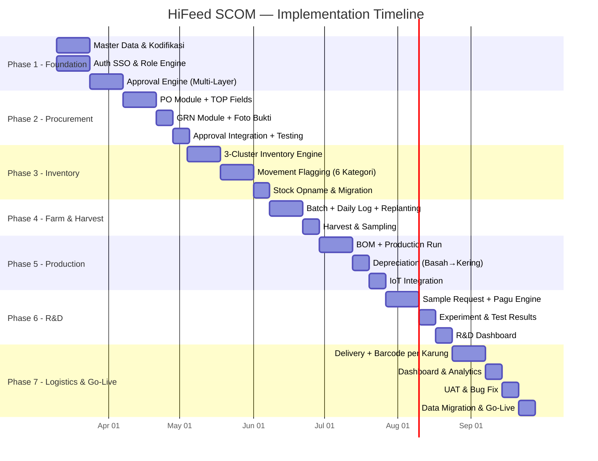
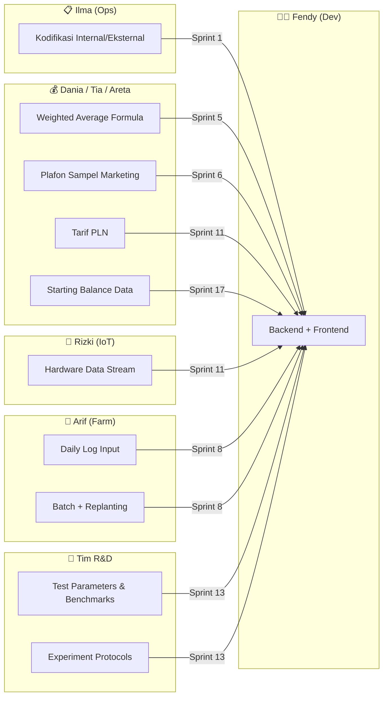

# 📋 Project Planning — HiFeed SCOM v2.0
**Berdasarkan**: PRD v2.0 & Keputusan Rapat 3 Maret 2026
**Timeline**: Maret 2026 — September 2026 (7 Bulan / 28 Minggu)
**Developer**: Fendy Irfan (Solo Dev + AI Assistant)
**Status**: Draft — Pending Approval Ihsan

---

## Timeline Overview

---

## Phase 1: Foundation & Infrastructure
**Durasi**: Minggu 1–4 (10 Mar — 4 Apr 2026)

### Sprint 1 — Master Data & Auth (10–23 Mar)

| # | Task | Priority | PIC | Deps |
|---|---|:---:|---|---|
| 1.1 | Setup backend project (Django + PostgreSQL + Docker) | 🔴 | Fendy | — |
| 1.2 | Google SSO integration (restricted `@hifeed.co`) | 🔴 | Fendy | 1.1 |
| 1.3 | CRUD Master Products + kodifikasi fields (`internal_code`, `external_code`, `product_cluster`) | 🔴 | Fendy | 1.1 |
| 1.4 | Input 10 raw material kodifikasi dari tabel Ilma | 🟡 | Fendy + Ilma | 1.3 |
| 1.5 | CRUD Master Partners (Vendor + Customer) | 🟡 | Fendy | 1.1 |
| 1.6 | CRUD Master Locations (Gudang, Lahan) | 🟡 | Fendy | 1.1 |
| 1.7 | Role & Permission engine (8 roles incl. R&D, access matrix) | 🔴 | Fendy | 1.2 |

**Deliverable**: Backend running, SSO works, master data populated, 8 roles configured.

### Sprint 2 — Approval Engine (24 Mar — 4 Apr)

| # | Task | Priority | PIC | Deps |
|---|---|:---:|---|---|
| 2.1 | `approval_logs` table + API | 🔴 | Fendy | 1.7 |
| 2.2 | Multi-layer approval logic (≤50jt → 1 layer, >50jt → 2 layer) | 🔴 | Fendy | 2.1 |
| 2.3 | Owner backup-approve capability | 🟡 | Fendy | 2.2 |
| 2.4 | Approval notification system (email/in-app) | 🟢 | Fendy | 2.2 |

**Deliverable**: Approval engine reusable untuk PO, R&D sample request, dan modul lain.

---

## Phase 2: Procurement Module
**Durasi**: Minggu 5–8 (7 Apr — 2 Mei 2026)

### Sprint 3 — Purchase Order (7–20 Apr)

| # | Task | Priority | PIC | Deps |
|---|---|:---:|---|---|
| 3.1 | PO table schema + API (CRUD) | 🔴 | Fendy | 1.3 |
| 3.2 | PO status enum (7 status: DRAFT → CANCELLED) | 🔴 | Fendy | 3.1 |
| 3.3 | Term of Payment fields (`order_date`, `expected_arrival`, `payment_due`) | 🔴 | Fendy | 3.1 |
| 3.4 | Volume standardisasi (KG base unit + package unit alt) | 🟡 | Fendy + Dania | 3.1 |
| 3.5 | Weighted Average unit price calculation | 🟡 | Fendy + Dania | 3.4 |
| 3.6 | Integrate approval engine ke PO submit flow | 🔴 | Fendy | 2.2, 3.1 |
| 3.7 | Frontend PO list, create, detail pages | 🔴 | Fendy | 3.1–3.6 |
| 3.8 | Hidden `created_at` (backend only, not front-end) | 🟢 | Fendy | 3.7 |

### Sprint 4 — GRN & Testing (21 Apr — 2 Mei)

| # | Task | Priority | PIC | Deps |
|---|---|:---:|---|---|
| 4.1 | GRN table + API | 🔴 | Fendy | 3.1 |
| 4.2 | Manual weighing input + foto upload (timbangan) | 🔴 | Fendy | 4.1 |
| 4.3 | Partial receiving → auto-update PO status | 🟡 | Fendy | 4.1, 3.2 |
| 4.4 | Frontend GRN create + list pages | 🔴 | Fendy | 4.1–4.3 |
| 4.5 | E2E test: PO → Approval → GRN → Partial → Complete | 🟡 | Fendy | All above |

**Deliverable**: Full Procurement flow working end-to-end with approval.

---

## Phase 3: Inventory Engine
**Durasi**: Minggu 9–13 (4 Mei — 6 Jun 2026)

### Sprint 5 — 3-Cluster Inventory (4–17 Mei)

| # | Task | Priority | PIC | Deps |
|---|---|:---:|---|---|
| 5.1 | Stock Items table + 3 cluster enum (`RAW_MATERIAL`, `FINISHED_GOOD`, `TRADING`) | 🔴 | Fendy | 1.3 |
| 5.2 | Stock Ledger (journal-style movement tracking) | 🔴 | Fendy | 5.1 |
| 5.3 | Multi-UoM conversion engine (KG ↔ Karung ↔ Pcs) | 🟡 | Fendy | 5.1 |
| 5.4 | Inventory valuation — Weighted Average per product | 🔴 | Fendy + Dania | 5.2 |
| 5.5 | Dashboard: Total Inventory Value (agregat 3 cluster) | 🟡 | Fendy | 5.4 |
| 5.6 | Frontend: Stock Overview + Stock Ledger pages | 🔴 | Fendy | 5.1–5.4 |

### Sprint 6 — Movement Flagging (18–31 Mei)

| # | Task | Priority | PIC | Deps |
|---|---|:---:|---|---|
| 6.1 | `stock_movements` table + 6 flag enum | 🔴 | Fendy | 5.1 |
| 6.2 | `SALES` flag — auto-deduct based on formula/recipe | 🔴 | Fendy | 6.1 |
| 6.3 | `MARKETING_SAMPLE` flag — pagu limit engine (% dari inventory) | 🔴 | Fendy + Dania | 6.1 |
| 6.4 | `RND_SAMPLE` flag — max 2% (shared engine with R&D Module) | 🟡 | Fendy | 6.1 |
| 6.5 | `WAREHOUSE_TRANSFER` flag — pindah lokasi, valuasi tetap | 🟡 | Fendy | 6.1 |
| 6.6 | `DEFECT` flag — wajib foto bukti + alasan | 🟡 | Fendy | 6.1 |
| 6.7 | `RETURN` flag — reverse dari sales | 🟢 | Fendy | 6.1 |
| 6.8 | Frontend: Movement form + history view | 🔴 | Fendy | 6.1–6.7 |

### Sprint 7 — Stock Opname & Migration (1–6 Jun)

| # | Task | Priority | PIC | Deps |
|---|---|:---:|---|---|
| 7.1 | Stock Opname page (input fisik vs sistem, hitung selisih) | 🟡 | Fendy | 5.1 |
| 7.2 | Starting balance migration script (dari Excel Accounting) | 🔴 | Fendy + Dania | 5.1 |
| 7.3 | Variance reason input + adjustment log | 🟢 | Fendy | 7.1 |

**Deliverable**: Complete inventory system with 3 clusters, 6 movement types, and migrated starting balance.

---

## Phase 4: Farm & Harvest
**Durasi**: Minggu 14–16 (8 Jun — 28 Jun 2026)

### Sprint 8 — Batch & Daily Log (8–21 Jun)

| # | Task | Priority | PIC | Deps |
|---|---|:---:|---|---|
| 8.1 | `farm_batches` table + API (batch ID, QR code) | 🔴 | Fendy | 1.6 |
| 8.2 | Replanting → enforce batch baru (blokir campur batch) | 🔴 | Fendy | 8.1 |
| 8.3 | `daily_logs` table + API (mortality, tenaga kerja, jam) | 🔴 | Fendy | 8.1 |
| 8.4 | HST auto-calculator (Hari Setelah Tanam) | 🟡 | Fendy | 8.1 |
| 8.5 | Frontend: Batches list, create, detail + Daily Log form | 🔴 | Fendy | 8.1–8.4 |
| 8.6 | Mobile-friendly forms untuk petugas lapangan | 🟡 | Fendy | 8.5 |

### Sprint 9 — Harvest (22–28 Jun)

| # | Task | Priority | PIC | Deps |
|---|---|:---:|---|---|
| 9.1 | `harvest_results` table + sampling method calc | 🔴 | Fendy | 8.1 |
| 9.2 | Estimated population = total weight / avg sample weight | 🟡 | Fendy | 9.1 |
| 9.3 | Final mortality rate calculation | 🟡 | Fendy | 9.1, 8.3 |
| 9.4 | Auto-increment stock (raw material) setelah harvest | 🔴 | Fendy | 9.1, 5.2 |

**Deliverable**: Farm fully operational — batch to harvest to stock.

---

## Phase 5: Production & IoT
**Durasi**: Minggu 17–20 (29 Jun — 26 Jul 2026)

### Sprint 10 — BOM & Production (29 Jun — 12 Jul)

| # | Task | Priority | PIC | Deps |
|---|---|:---:|---|---|
| 10.1 | BOM (Bill of Materials) table + formula per produk | 🔴 | Fendy | 1.3 |
| 10.2 | Multi-formula support (PK 18, PK 15, Laktasi, Non-Laktasi) | 🔴 | Fendy | 10.1 |
| 10.3 | Production Run CRUD + auto-deduct raw material (backflush) | 🔴 | Fendy | 10.1, 5.2 |
| 10.4 | Tie-in: volume RM keluar ↔ formula produk jadi | 🟡 | Fendy | 10.2, 10.3 |
| 10.5 | Frontend: Production Run list, create + BOM setup page | 🔴 | Fendy | 10.1–10.4 |

### Sprint 11 — Depreciation & IoT (13–26 Jul)

| # | Task | Priority | PIC | Deps |
|---|---|:---:|---|---|
| 11.1 | Depreciation tracking: input basah vs output kering + shrinkage % | 🔴 | Fendy | 10.3 |
| 11.2 | IoT data ingestion endpoint (MQTT/WebSocket) | 🟡 | Fendy + Rizki | 1.1 |
| 11.3 | Mesin monitoring: jam nyala, temperatur, overheat alert | 🟡 | Fendy + Rizki | 11.2 |
| 11.4 | Biaya listrik calc (HP × 0.746 × jam × tarif PLN/KWH) | 🟡 | Fendy + Tia | 11.2 |
| 11.5 | Machine dashboard: status, runtime, maintenance schedule | 🟢 | Fendy | 11.2–11.3 |

**Deliverable**: Production with BOM, depreciation tracking, and IoT machine monitoring.

---

## Phase 6: R&D Module 🧪
**Durasi**: Minggu 21–24 (27 Jul — 22 Ags 2026)

### Sprint 12 — Sample Request & Pagu (27 Jul — 9 Ags)

| # | Task | Priority | PIC | Deps |
|---|---|:---:|---|---|
| 12.1 | `rnd_sample_requests` table + API (CRUD) | 🔴 | Fendy | 5.1 |
| 12.2 | Sample source enum: `RAW_WET`, `RAW_DRY`, `FINISHED_GOOD` | 🔴 | Fendy | 12.1 |
| 12.3 | Pagu engine: auto-calc 2% × Total Inventory Value | 🔴 | Fendy | 12.1, 5.4 |
| 12.4 | Under-pagu → auto-approve; Over-pagu → Owner approval | 🔴 | Fendy | 12.3, 2.2 |
| 12.5 | Inventory auto-deduct on sample fulfillment | 🟡 | Fendy | 12.1, 6.1 |
| 12.6 | Frontend: Sample Request list, create form, approval flow | 🔴 | Fendy | 12.1–12.5 |

### Sprint 13 — Experiment & Test Results (10–16 Ags)

| # | Task | Priority | PIC | Deps |
|---|---|:---:|---|---|
| 13.1 | `rnd_experiments` table + API (CRUD) | 🔴 | Fendy | — |
| 13.2 | Link experiments ↔ sample requests (M:N) | 🟡 | Fendy | 13.1, 12.1 |
| 13.3 | `rnd_test_results` table + API | 🔴 | Fendy | 13.1 |
| 13.4 | Test types: `NUTRITIONAL`, `PALATABILITY`, `SHELF_LIFE`, `FIELD_TRIAL` | 🟡 | Fendy | 13.3 |
| 13.5 | Pass/Fail auto-check against benchmark values | 🟡 | Fendy | 13.3 |
| 13.6 | File attachments: foto, lab reports, dokumen | 🟢 | Fendy | 13.1 |
| 13.7 | Frontend: Experiment list, detail, test result input | 🔴 | Fendy | 13.1–13.6 |

### Sprint 14 — R&D Dashboard (17–22 Ags)

| # | Task | Priority | PIC | Deps |
|---|---|:---:|---|---|
| 14.1 | R&D Dashboard: Active experiments count + status breakdown | 🔴 | Fendy | 13.1 |
| 14.2 | Budget usage: bar chart (pagu vs consumed) + traffic light | 🔴 | Fendy | 12.3 |
| 14.3 | Sample requests: pending/approved/fulfilled counters | 🟡 | Fendy | 12.1 |
| 14.4 | Test Results Summary: pass/fail rate per product | 🟡 | Fendy | 13.3 |
| 14.5 | Experiment timeline — Gantt-style view | 🟢 | Fendy | 13.1 |

**Deliverable**: Full R&D module — sample request with pagu control, experiment tracking, lab results, and R&D dashboard.

---

## Phase 7: Logistics, Dashboard & Go-Live
**Durasi**: Minggu 25–28 (24 Ags — 26 Sep 2026)

### Sprint 15 — Logistics & Barcode (24 Ags — 6 Sep)

| # | Task | Priority | PIC | Deps |
|---|---|:---:|---|---|
| 15.1 | Delivery Trip CRUD + driver/vehicle assignment | 🔴 | Fendy | — |
| 15.2 | POD upload (foto surat jalan) | 🟡 | Fendy | 15.1 |
| 15.3 | Barcode generation per karung (`HF-[CODE]-[BATCH]-[SERIAL]`) | 🔴 | Fendy | 10.3 |
| 15.4 | Barcode scan → trace back ke batch, supplier, lahan | 🔴 | Fendy | 15.3 |
| 15.5 | Frontend: Trip list, create, detail + POD viewer | 🔴 | Fendy | 15.1–15.2 |

### Sprint 16 — Dashboard & Analytics (7–13 Sep)

| # | Task | Priority | PIC | Deps |
|---|---|:---:|---|---|
| 16.1 | Dashboard: Total Inventory (3-cluster aggregate) | 🔴 | Fendy | 5.4 |
| 16.2 | Dashboard: Charts (panen, produksi, cost breakdown) | 🟡 | Fendy | All |
| 16.3 | Dashboard: Real-time alerts engine | 🟡 | Fendy | All |
| 16.4 | Report: COGS per Batch, Yield Efficiency, Labor Cost | 🟡 | Fendy + Dania | All |
| 16.5 | Ext report: auto-translate internal → external kodifikasi | 🟢 | Fendy | 1.4 |

### Sprint 17 — UAT & Go-Live (14–26 Sep)

| # | Task | Priority | PIC | Deps |
|---|---|:---:|---|---|
| 17.1 | UAT dengan seluruh tim (per-modul test scenario) | 🔴 | All | All |
| 17.2 | Bug fixing & polish | 🔴 | Fendy | 17.1 |
| 17.3 | Data migration: Excel cut-off → starting balance | 🔴 | Fendy + Dania | 7.2 |
| 17.4 | Production deployment | 🔴 | Fendy | 17.1–17.3 |
| 17.5 | User training & handover | 🟡 | Fendy | 17.4 |
| 17.6 | **🚀 GO-LIVE** | 🔴 | All | 17.5 |

---

## Dependency Map (Antar Tim)

---

## Milestones & Checkpoints

| Milestone | Target Date | Kriteria Selesai |
|---|---|---|
| ✅ **M1**: Foundation Ready | 4 Apr 2026 | SSO works, master data, approval engine, 8 roles |
| ✅ **M2**: Procurement Live | 2 Mei 2026 | PO → Approval → GRN flow E2E |
| ✅ **M3**: Inventory Engine | 6 Jun 2026 | 3-cluster, 6 flags, stock opname, WA valuation |
| ✅ **M4**: Farm & Harvest | 28 Jun 2026 | Batch → daily log → harvest → stock increment |
| ✅ **M5**: Production & IoT | 26 Jul 2026 | BOM, backflush, depreciation, IoT stream |
| 🧪 **M6**: R&D Module | 22 Ags 2026 | Sample request, pagu, experiments, test results |
| ✅ **M7**: Logistics & Traceability | 6 Sep 2026 | Delivery, POD, barcode per karung |
| 🚀 **GO-LIVE** | 26 Sep 2026 | UAT passed, data migrated, all users trained |

---

## Risk Register

| Risk | Impact | Likelihood | Mitigation |
|---|:---:|:---:|---|
| Kodifikasi dari Ilma terlambat | 🟡 Medium | 🟡 Medium | Gunakan placeholder, update batch setelah terima |
| Internet tidak stabil di pabrik (IoT) | 🔴 High | 🟡 Medium | Rizki test koneksi ASAP; fallback: manual input |
| R&D test parameters belum defined | 🟡 Medium | 🟡 Medium | Mulai Sprint 13 dengan placeholder, finalize saat UAT |
| Data migration gagal / tidak tally | 🔴 High | 🟢 Low | Dry run 2 minggu sebelum go-live |
| UAT menemukan bug kritis | 🟡 Medium | 🟡 Medium | Buffer 1 minggu sebelum go-live |
| Solo developer bottleneck | 🟡 Medium | 🟡 Medium | AI coding assistant + prioritas fitur |

---

## Presentasi Pak Wlan & Eran

**Tanggal**: 4 Maret 2026 (besok)
**Yang perlu disiapkan**:
- [ ] Demo mockup dashboard (current state)
- [ ] Highlight perubahan dari meeting (PRD v2 summary)
- [ ] Timeline overview (7 bulan, 17 sprint)
- [ ] R&D Module pitch — kenapa modul baru
- [ ] Action items per tim

---

> [!TIP]
> Planning ini adalah **living document**. Update setiap sprint review. Gunakan checklist di atas untuk tracking progress.
