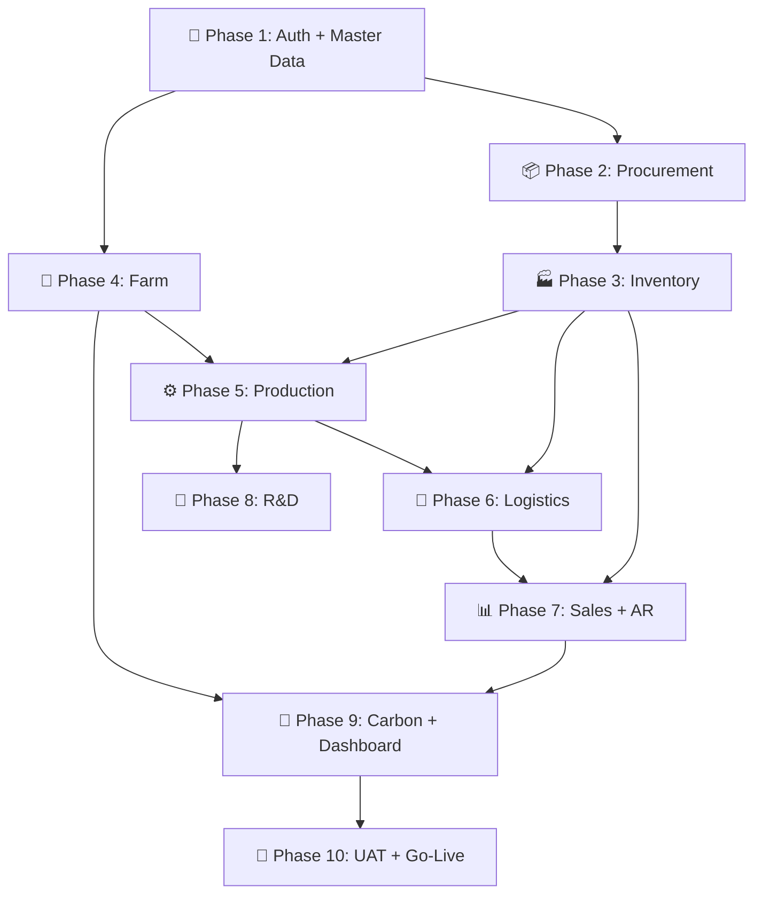
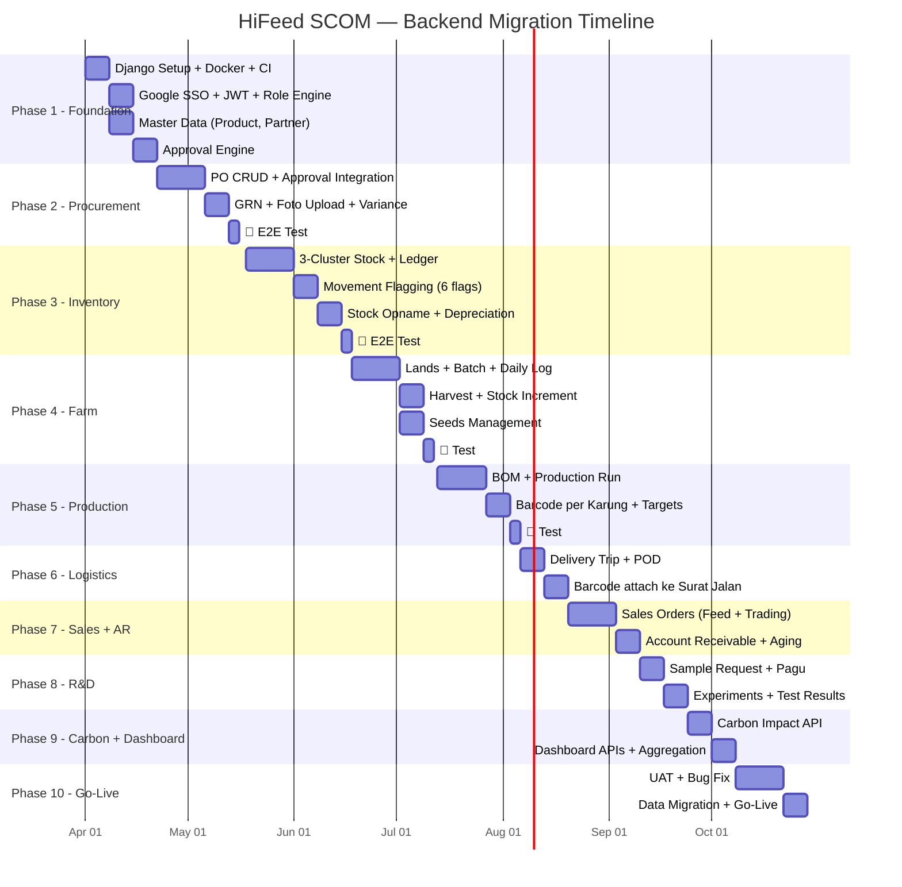
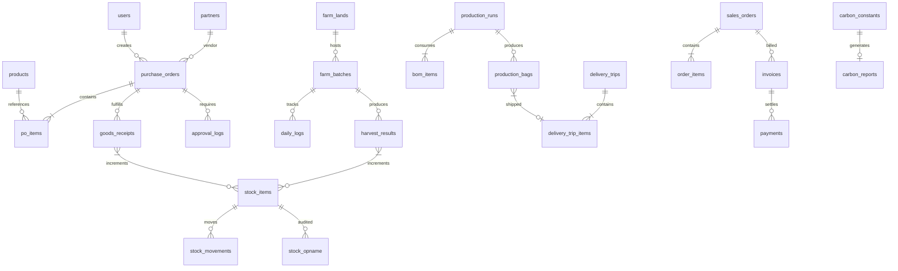

# 📋 Backend Implementation Planning — HiFeed SCOM v3.1
**Berdasarkan**: PRD v3.1 (15 Maret 2026), Mockup Complete (37 Halaman, 11 Modul)
**Timeline**: April 2026 — September 2026 (6 Bulan / 24 Minggu)
**Developer**: Fendy Irfan (Solo Dev + AI Assistant)
**Stack**: Django 5 + DRF + PostgreSQL 16 + Next.js 16 (existing frontend)
**Status**: Draft — Pending Approval

---

> [!IMPORTANT]
> Dokumen ini adalah **roadmap implementasi backend** untuk memigrasikan sistem HiFeed SCOM dari **mockup (mock-data)** → **production backend (Django + PostgreSQL)**. Urutan modul diprioritaskan berdasarkan **dependency chain** dan **business value**.

---

## Filosofi: Mengapa Urutan Ini?

**Prinsip urutan**:
1. **Auth & Master Data dulu** — semua modul bergantung pada user, product, dan partner
2. **Procurement → Inventory** — barang masuk dulu sebelum bisa dikelola/keluar
3. **Farm → Production** — bahan baku dari lahan masuk ke produksi
4. **Sales & Logistics** — barang jadi dijual dan dikirim
5. **Carbon & Dashboard** — aggregasi dari semua data di atas

---

## Timeline Overview

---

## Phase 1: Foundation & Infrastructure
**Durasi**: 3 minggu (1 Apr — 18 Apr 2026)
**Goal**: Backend running, auth works, master data API ready

### Sprint 1 — Setup & Auth (1–11 Apr)

| # | Task | Estimasi | Detail |
|---|---|:---:|---|
| 1.1 | Django project setup + PostgreSQL + Docker Compose | 2 hari | `docker-compose.yml` → Django + PostgreSQL + Redis |
| 1.2 | CI/CD pipeline (GitHub Actions) | 1 hari | Lint, test, build on push |
| 1.3 | Google SSO integration (`@hifeed.co` restricted) | 2 hari | `django-allauth` + JWT (`djangorestframework-simplejwt`) |
| 1.4 | Role & Permission engine (8 roles) | 2 hari | Custom `User` model, `roleAccessMatrix` di backend |
| 1.5 | Frontend auth adapter (replace mock auth → real JWT) | 1 hari | `AuthContext` → fetch from Django API |

**Test Checklist**:
- [ ] `POST /api/auth/google/` → returns JWT token
- [ ] JWT token contains role + user info
- [ ] Role OWNER can access admin endpoints
- [ ] Role FARM_MANAGER cannot access IT Admin endpoints
- [ ] Invalid token → 401 Unauthorized
- [ ] Non `@hifeed.co` email → 403 Forbidden

### Sprint 2 — Master Data & Approval (8–18 Apr)

| # | Task | Estimasi | Detail |
|---|---|:---:|---|
| 2.1 | `products` table + CRUD API | 2 hari | 3-layer kodifikasi (internal, external, secret) |
| 2.2 | `partners` table + CRUD API | 1 hari | Vendor + Customer combined |
| 2.3 | `locations` table (gudang, lahan) | 1 hari | Reusable untuk Farm & Inventory |
| 2.4 | `approval_logs` table + Multi-layer engine | 2 hari | ≤50jt → 1 layer (Finance/Owner), >50jt → 2 layer |
| 2.5 | Seed migration script (10 RM + 5 FG dari kodifikasi) | 1 hari | `python manage.py seed_products` |

**Test Checklist**:
- [ ] CRUD products → internal code unique constraint
- [ ] Secret name encrypted at rest (Django `encrypted_fields`)
- [ ] Approval: PO 40jt → Finance approve → APPROVED
- [ ] Approval: PO 40jt → Owner approve → APPROVED (backup)
- [ ] Approval: PO 80jt → Finance approve → masih PENDING (needs Owner)
- [ ] Approval: PO 80jt → Finance + Owner approve → APPROVED

---

## Phase 2: Procurement Module
**Durasi**: 3 minggu (22 Apr — 16 Mei 2026)
**Dependency**: Phase 1 (Auth + Master Data + Approval)
**Goal**: Full PO → Approval → GRN flow

### Sprint 3 — Purchase Order (22 Apr — 2 Mei)

| # | Task | Estimasi | Detail |
|---|---|:---:|---|
| 3.1 | `purchase_orders` + `po_items` table + CRUD API | 3 hari | Status enum (7 status), auto PO number |
| 3.2 | PO submit → trigger approval flow | 1 hari | Integrate approval engine Sprint 2 |
| 3.3 | Term of Payment fields + payment_due auto-calc | 1 hari | COD, NET14, NET30, dll |
| 3.4 | Volume (KG) + Weighted Average unit price | 1 hari | Sync dgn Dania (Accounting) |
| 3.5 | Frontend: replace mock PO data → real API | 2 hari | `/procurement/po`, `/procurement/po/create`, `/procurement/po/[id]` |

### Sprint 4 — GRN & E2E Test (5–16 Mei)

| # | Task | Estimasi | Detail |
|---|---|:---:|---|
| 4.1 | `goods_receipts` table + API | 2 hari | Link ke PO, qty received |
| 4.2 | Foto upload (timbangan) → cloud storage | 1 hari | Django + GCS/S3 |
| 4.3 | Variance calc (expected vs actual qty) | 1 hari | Auto-create depreciation log |
| 4.4 | Partial receiving → auto-update PO status | 1 hari | PARTIAL_RECEIVED, COMPLETED |
| 4.5 | Frontend: replace mock GRN data → real API | 1 hari | `/procurement/grn` |

**🧪 E2E Test Sprint 4** (3 hari):

| Test Case | Steps | Expected |
|---|---|---|
| **TC-PROC-01**: Happy path PO ≤50jt | Create PO 30jt → Submit → Finance approve | Status = APPROVED |
| **TC-PROC-02**: PO >50jt dual approval | Create PO 80jt → Submit → Finance approve → Owner approve | Status = APPROVED |
| **TC-PROC-03**: Owner bypass | Create PO 30jt → Submit → Owner approve (tanpa Finance) | Status = APPROVED |
| **TC-PROC-04**: PO reject | Create PO → Submit → Finance reject dengan alasan | Status = REJECTED, alasan tersimpan |
| **TC-PROC-05**: GRN partial | PO 1000 KG → GRN 600 KG | PO = PARTIAL_RECEIVED |
| **TC-PROC-06**: GRN complete | PO 1000 KG → GRN 600 + GRN 400 | PO = COMPLETED |
| **TC-PROC-07**: GRN variance | PO 1000 KG → GRN 950 KG (actual) | Depreciation log created: 50 KG, reason: HANDLING_LOSS |
| **TC-PROC-08**: Foto upload | Upload foto timbangan | URL tersimpan, file accessible |

---

## Phase 3: Inventory Engine
**Durasi**: 4 minggu (18 Mei — 18 Jun 2026)
**Dependency**: Phase 2 (GRN auto-increment stock)
**Goal**: Stock akurat, movement tracked, depreciation calculated

### Sprint 5 — Stock Core (18–31 Mei)

| # | Task | Estimasi | Detail |
|---|---|:---:|---|
| 5.1 | `stock_items` table + 3-cluster enum | 2 hari | RM, FG, TRADING |
| 5.2 | Stock Ledger (journal-style: setiap IN/OUT = 1 row) | 2 hari | Immutable audit trail |
| 5.3 | GRN → auto-increment stock (RM cluster) | 1 hari | Integrate with Phase 2 |
| 5.4 | Weighted Average valuation per product | 1 hari | `total_value / total_qty` |
| 5.5 | Stock detail page API (`/inventory/stock/[id]`) | 1 hari | Ledger history per item |
| 5.6 | Frontend: replace mock stock data → API | 2 hari | `/inventory/stock`, `/inventory/stock/[id]` |

### Sprint 6 — Movements & Opname (1–14 Jun)

| # | Task | Estimasi | Detail |
|---|---|:---:|---|
| 6.1 | `stock_movements` table + 6 flag enum | 2 hari | SALES, MARKETING_SAMPLE, RND_SAMPLE, dll |
| 6.2 | Pagu engine: Marketing Sample max 100 KG | 1 hari | Hard lock validation |
| 6.3 | Pagu engine: R&D Sample max 2% inventory value | 1 hari | Shared with R&D module |
| 6.4 | Stock Opname: input fisik vs sistem + variance | 2 hari | Auto-create depreciation |
| 6.5 | `depreciation_logs` table + aggregation API | 2 hari | Stats: total loss, avg %, by stage |
| 6.6 | Frontend: replace mock movement + opname + depreciation | 2 hari | 3 halaman |

**🧪 E2E Test Sprint 6** (3 hari):

| Test Case | Steps | Expected |
|---|---|---|
| **TC-INV-01**: GRN → Stock | Create PO → Approve → GRN 500 KG | Stock DM_CPTN1 += 500 KG |
| **TC-INV-02**: Movement SALES | Create movement SALES 100 KG | Stock -= 100, ledger entry created |
| **TC-INV-03**: Pagu Marketing | Submit MARKETING_SAMPLE 120 KG (over limit 100 KG) | ❌ BLOCKED — error "Pagu exceeded" |
| **TC-INV-04**: Pagu R&D | Submit RND_SAMPLE > 2% inventory value | ❌ BLOCKED — butuh Owner approval |
| **TC-INV-05**: Stock Opname | Sistem: 500 KG, Fisik: 480 KG | Variance -20 KG → depreciation log |
| **TC-INV-06**: Weighted Average | PO-1: 100KG@5000, PO-2: 200KG@6000 | WA = (500K+1.2M)/300 = Rp 5,667/KG |
| **TC-INV-07**: Depreciation stats | 3 depreciation events | Total loss KG, avg %, top reason correct |

---

## Phase 4: Farm Management
**Durasi**: 3 minggu (18 Jun — 11 Jul 2026)
**Dependency**: Phase 1 (Master Data / Locations), Phase 3 (Stock — for harvest increment)
**Goal**: Lahan aktif, batch tracking, daily log, harvest → stock

### Sprint 7 — Land, Batch, Daily Log (18 Jun — 4 Jul)

| # | Task | Estimasi | Detail |
|---|---|:---:|---|
| 7.1 | `farm_lands` table + CRUD API (inline form) | 2 hari | Status: ACTIVE, RESTING, PREP |
| 7.2 | `farm_batches` table + CRUD API (inline form) | 2 hari | Link to land, auto HST calc |
| 7.3 | `daily_logs` table + API | 2 hari | Mortality count, labor hours |
| 7.4 | `seeds` table + API | 1 hari | Seed catalog + stock tracking |
| 7.5 | Frontend: replace mock farm data → API | 2 hari | 4-5 halaman |

### Sprint 8 — Harvest & Testing (5–11 Jul)

| # | Task | Estimasi | Detail |
|---|---|:---:|---|
| 8.1 | `harvest_results` table + API | 2 hari | Sampling method, estimated pop |
| 8.2 | Harvest → auto-increment stock (RM) | 1 hari | Integrate with inventory |
| 8.3 | Final mortality rate calc | 1 hari | (initial - final) / initial × 100 |
| 8.4 | Replanting → enforce new batch | 1 hari | Block mixing old batch |

**🧪 E2E Test Sprint 8** (3 hari):

| Test Case | Steps | Expected |
|---|---|---|
| **TC-FARM-01**: Create lahan inline | Submit form: "Lahan Canggu A", 2.1 Ha | Lahan created, status PREPARATION |
| **TC-FARM-02**: Create batch | Select lahan → create batch DM_CPTN1 | Batch active, HST = 0, lahan = ACTIVE |
| **TC-FARM-03**: Daily log | Log 5 mortality, 3 pekerja, 8 jam | Mortality count updated |
| **TC-FARM-04**: Harvest → Stock | Harvest 500 KG from batch | Stock DM_CPTN1 += 500, batch HARVESTED |
| **TC-FARM-05**: Replanting | Try add to old batch | ❌ Error: must create new batch |
| **TC-FARM-06**: Carbon data | 3 lahan active (6.3 Ha total) | Carbon dashboard reads 6.3 Ha correctly |

---

## Phase 5: Production & Barcode
**Durasi**: 3 minggu (13 Jul — 6 Ags 2026)
**Dependency**: Phase 3 (Inventory — RM deduction), Phase 4 (Farm — RM source)
**Goal**: BOM → Production Run → FG stock + barcode per karung

### Sprint 9 — BOM & Production Run (13–26 Jul)

| # | Task | Estimasi | Detail |
|---|---|:---:|---|
| 9.1 | `bom` + `bom_items` table | 2 hari | Formula per FG product |
| 9.2 | `production_runs` table + API | 2 hari | Auto RM deduction (backflush) |
| 9.3 | Production result → auto-increment FG stock | 1 hari | Output KG → stock FG cluster |
| 9.4 | Depreciation: input RM vs output FG (processing loss) | 1 hari | Auto depreciation |
| 9.5 | `production_targets` table + API (Owner-only set) | 1 hari | Monthly target per FG |

### Sprint 10 — Barcode & Testing (27 Jul — 6 Ags)

| # | Task | Estimasi | Detail |
|---|---|:---:|---|
| 10.1 | `production_bags` table + barcode generation | 2 hari | Format: HF-PR2026XXX-001 |
| 10.2 | Barcode lookup API (scan → full journey) | 1 hari | Trace batch + BOM + delivery |
| 10.3 | Complaint handling flow | 1 hari | Flag as COMPLAINT + notes |
| 10.4 | Frontend: replace mock production + barcode | 2 hari | 3 halaman |

**🧪 E2E Test Sprint 10** (3 hari):

| Test Case | Steps | Expected |
|---|---|---|
| **TC-PROD-01**: Production run | BOM needs 100KG RM → produce 90KG FG | RM -= 100, FG += 90, depreciation 10KG |
| **TC-PROD-02**: Monthly target | Owner set target FG_GC = 500 KG Mar | Progress bar shows actual/500 |
| **TC-PROD-03**: Barcode gen | Production 90KG ÷ 25KG/bag = 3 bags | 3 barcodes generated |
| **TC-PROD-04**: Barcode lookup | Scan HF-PR2026001-002 | Show: batch, BOM, date, product |
| **TC-PROD-05**: Complaint | Flag bag as COMPLAINT + notes | Status changed, complaint visible |
| **TC-PROD-06**: Full trace | Barcode → production → BOM items → PO → vendor | Complete chain traceable |

---

## Phase 6: Logistics
**Durasi**: 2 minggu (6–20 Ags 2026)
**Dependency**: Phase 5 (barcode per karung → attach ke trip)
**Goal**: Delivery trip, POD, barcode traceability

### Sprint 11 — Delivery & POD (6–20 Ags)

| # | Task | Estimasi | Detail |
|---|---|:---:|---|
| 11.1 | `delivery_trips` + `trip_items` table + API | 2 hari | DO number, driver, vehicle |
| 11.2 | Barcode attachment ke trip items | 1 hari | Scan bag → link ke trip |
| 11.3 | POD upload + status flow | 1 hari | LOADING → ON_THE_WAY → DELIVERED |
| 11.4 | Bag status auto-update on delivery | 1 hari | IN_STOCK → SHIPPED → DELIVERED |
| 11.5 | Frontend: replace mock logistics | 1 hari | 3 halaman |

**🧪 Test**:
- [ ] Create trip → assign bags → LOADING
- [ ] Upload POD → status = DELIVERED → bags = DELIVERED
- [ ] Bag barcode scan shows delivery info

---

## Phase 7: Sales & Account Receivable
**Durasi**: 2 minggu (20 Ags — 10 Sep 2026)
**Dependency**: Phase 3 (Inventory), Phase 6 (Logistics)
**Goal**: Sales orders, auto-calc margin, AR aging

### Sprint 12 — Sales + AR (20 Ags — 10 Sep)

| # | Task | Estimasi | Detail |
|---|---|:---:|---|
| 12.1 | `sales_orders` + `order_items` table | 2 hari | Unified Feed + Trading |
| 12.2 | Auto-calc: Total, Cost, Margin, GP | 1 hari | Cost from WA valuation |
| 12.3 | Stock deduction on order fulfillment | 1 hari | Movement flag = SALES |
| 12.4 | `invoices` + `payments` table (AR engine) | 2 hari | Aging: 0-30, 31-60, 61-90, >90 |
| 12.5 | AR Dashboard API (outstanding, overdue, collection rate) | 1 hari | Aggregation queries |
| 12.6 | Frontend: replace mock sales + AR | 2 hari | `/sales/feed`, `/sales/ar` |

**🧪 Test**:
- [ ] New order → stock deducted → movement SALES created
- [ ] Margin auto-calc correct (sell - cost / sell × 100)
- [ ] Invoice created → not paid in 30 days → status OVERDUE_30
- [ ] Payment received → AR reduced → status updated

---

## Phase 8: R&D Module
**Durasi**: 2 minggu (10–24 Sep 2026)
**Dependency**: Phase 3 (Inventory — pagu calc), Phase 1 (Approval)

### Sprint 13 — R&D (10–24 Sep)

| # | Task | Estimasi | Detail |
|---|---|:---:|---|
| 13.1 | `rnd_sample_requests` + pagu check | 2 hari | Auto-approve if < 2% |
| 13.2 | `rnd_experiments` + `rnd_test_results` | 2 hari | 4 test types |
| 13.3 | Link sample → experiment (M:N) | 1 hari | |
| 13.4 | R&D Dashboard API | 1 hari | Budget usage, active experiments |
| 13.5 | Frontend: replace mock R&D | 1 hari | 3 halaman |

---

## Phase 9: Carbon Impact & Dashboard
**Durasi**: 2 minggu (24 Sep — 8 Okt 2026)
**Dependency**: Phase 4 (Farm — active Ha), Phase 7 (Sales — total ton sold)
**Goal**: Carbon formula fungsional, dashboard live

### Sprint 14 — Carbon & Dashboard APIs (24 Sep — 8 Okt)

| # | Task | Estimasi | Detail |
|---|---|:---:|---|
| 14.1 | `carbon_constants` table (8 dynamic variables) | 1 hari | CRUD, Owner/RND edit |
| 14.2 | Carbon API: calc from real sales + farm data | 2 hari | Replace mock calcCarbonMetrics |
| 14.3 | Dashboard aggregation APIs (all KPI stats) | 2 hari | Replace all mock dashboard data |
| 14.4 | Traceability API (supply chain + batch tracking) | 1 hari | Aggregates from all modules |
| 14.5 | IT Admin APIs (audit log, export, settings, users) | 2 hari | 5 sub-modules |
| 14.6 | Frontend: replace ALL remaining mock data | 2 hari | Final mock-data elimination |

**🧪 Test**:
- [ ] Carbon constants editable → dashboard recalculates
- [ ] Total sales from real DB = correct tCO₂e
- [ ] Active Ha from farm lands = correct sequestration
- [ ] Dashboard stats match real data from all modules

---

## Phase 10: UAT & Go-Live
**Durasi**: 3 minggu (8–29 Okt 2026)
**Goal**: System validated, data migrated, 🚀 LIVE

### Sprint 15 — UAT (8–22 Okt)

| # | Task | Estimasi | Detail |
|---|---|:---:|---|
| 15.1 | **UAT per modul** — setiap tim test modul mereka | 1 minggu | Test scenarios dari semua phase |
| 15.2 | Bug fixing & polish | 1 minggu | Priority: P0 (blocker) → P1 (major) |

#### UAT Participants & Scope

| Tester | Role | Modul yang Ditest |
|---|---|---|
| Ihsan (Owner) | OWNER | Dashboard, Approval, Targets, Carbon |
| Dania (Finance) | FINANCE | PO Approval, Inventory Valuation, AR |
| Arif (Farm) | FARM_MANAGER | Lands, Batches, Daily Log, Harvest |
| Operator | OPERATOR | Production Run, BOM, Barcode |
| Naura (R&D) | RND | Sample Request, Experiments, Carbon Variables |
| Yoga (Sales) | SALES | Sales Orders, New Order, AR |
| Budi (Logistics) | LOGISTICS | Trips, POD |
| Fendi (IT) | IT_OPS | Kodifikasi, Users, Audit, Export, Settings |

### Sprint 16 — Data Migration & Go-Live (22–29 Okt)

| # | Task | Estimasi | Detail |
|---|---|:---:|---|
| 16.1 | Data migration script (Excel → PostgreSQL) | 2 hari | Starting balance, products, partners |
| 16.2 | Dry run migration (test environment) | 1 hari | Verify data integrity |
| 16.3 | Production deployment | 1 hari | Docker → cloud server |
| 16.4 | Final validation + user training | 1 hari | |
| 16.5 | **🚀 GO-LIVE** | — | 29 Oktober 2026 |

---

## Database Schema Priority

Urutan pembuatan tabel berdasarkan dependency:

| Batch | Tabel | Phase | Sprint |
|---|---|---|---|
| 1 | `users`, `products`, `partners`, `locations` | 1 | 1-2 |
| 2 | `approval_logs` | 1 | 2 |
| 3 | `purchase_orders`, `po_items`, `goods_receipts` | 2 | 3-4 |
| 4 | `stock_items`, `stock_movements`, `stock_opname`, `depreciation_logs` | 3 | 5-6 |
| 5 | `farm_lands`, `farm_batches`, `daily_logs`, `seeds`, `harvest_results` | 4 | 7-8 |
| 6 | `bom`, `bom_items`, `production_runs`, `production_targets`, `production_bags` | 5 | 9-10 |
| 7 | `delivery_trips`, `trip_items`, `pod_documents` | 6 | 11 |
| 8 | `sales_orders`, `order_items`, `invoices`, `payments` | 7 | 12 |
| 9 | `rnd_sample_requests`, `rnd_experiments`, `rnd_test_results` | 8 | 13 |
| 10 | `carbon_constants`, `audit_logs`, `system_settings` | 9 | 14 |

---

## Testing Strategy Summary

### Per-Sprint Testing

Setiap sprint berakhir dengan **3 hari testing** yang mencakup:

| Layer | Tool | Apa yang Ditest |
|---|---|---|
| **Unit Test** | `pytest` + `pytest-django` | Model validations, business logic, calculations |
| **API Test** | `pytest` + DRF test client | Endpoint CRUD, permissions, edge cases |
| **Integration Test** | `pytest` | Cross-module flows (PO → GRN → Stock) |
| **Frontend Test** | Manual + browser tools | UI renders correctly from real API |

### Automated Test Targets

| Metric | Target |
|---|---|
| Unit test coverage | ≥ 80% per module |
| API test per endpoint | ≥ 3 test cases (happy, error, edge) |
| E2E scenario per module | ≥ 5 test cases |
| Total test cases | ~150+ |

### Acceptance Criteria per Modul

| Modul | ✅ Accept jika... |
|---|---|
| Auth | SSO login → JWT → role-based access works |
| Procurement | PO → Approval (1/2 layer) → GRN → Stock increment |
| Inventory | 3-cluster stock + 6 movement flags + pagu hard-lock |
| Farm | Land → Batch → Daily Log → Harvest → Stock |
| Production | BOM → Run → RM deduct → FG increment → Barcode |
| Logistics | Trip → Bag attach → POD upload → status cascade |
| Sales | Order → Cost calc → Stock deduct → Invoice → AR aging |
| R&D | Sample request → Pagu check → Experiment → Results |
| Carbon | Constants editable → Hero/Pilar/Chart auto-recalc from real data |

---

## Milestones & Checkpoints

| Milestone | Target | Kriteria Lulus |
|---|---|---|
| **M1**: Auth + Master | 18 Apr 2026 | SSO works, 8 roles, products + partners seeded |
| **M2**: Procurement E2E | 16 Mei 2026 | PO → Approval → GRN → Stock, 8 test cases pass |
| **M3**: Inventory Complete | 18 Jun 2026 | 3-cluster, 6 flags, opname, depreciation, 7 test cases pass |
| **M4**: Farm Complete | 11 Jul 2026 | Land → Batch → Harvest → Stock, 6 test cases pass |
| **M5**: Production + Barcode | 6 Ags 2026 | BOM → Run → FG → Barcode → Trace, 6 test cases pass |
| **M6**: Logistics Done | 20 Ags 2026 | Trip → POD → Bag status cascade |
| **M7**: Sales + AR | 10 Sep 2026 | Orders + Auto margin + AR aging |
| **M8**: R&D Done | 24 Sep 2026 | Sample + Pagu + Experiments |
| **M9**: Carbon + Dashboard | 8 Okt 2026 | All dashboard APIs from real data |
| **🚀 GO-LIVE** | **29 Okt 2026** | UAT passed, data migrated, all users trained |

---

## Risk Register

| Risk | Impact | Likelihood | Mitigation |
|---|:---:|:---:|---|
| Data migration Excel tally tidak cocok | 🔴 High | 🟡 Medium | Dry run 2 minggu sebelum go-live |
| Solo dev bottleneck (sick/leave) | 🟡 Medium | 🟡 Medium | AI coding assistant + modular sprints |
| Internet lahan tidak stabil | 🟡 Medium | 🟡 Medium | Offline-capable daily log form (PWA) |
| Weighted Average formula dispute dgn Accounting | 🔴 High | 🟢 Low | Validate dgn Dania sebelum Sprint 5 |
| Carbon formula investor challenge | 🟡 Medium | 🟡 Medium | Dynamic variables → Naura bisa adjust |
| Scope creep (fitur baru mid-sprint) | 🟡 Medium | 🔴 High | Strict sprint scope, new requests → backlog |

---

> [!TIP]
> Planning ini adalah **living document**. Update setiap sprint review.
> 
> **Quick Reference**:
> - Total: **10 Phase, 16 Sprint, ~24 minggu**
> - Total tabel database: **~30 tabel**
> - Total test cases: **~150+**
> - Go-Live target: **29 Oktober 2026**
