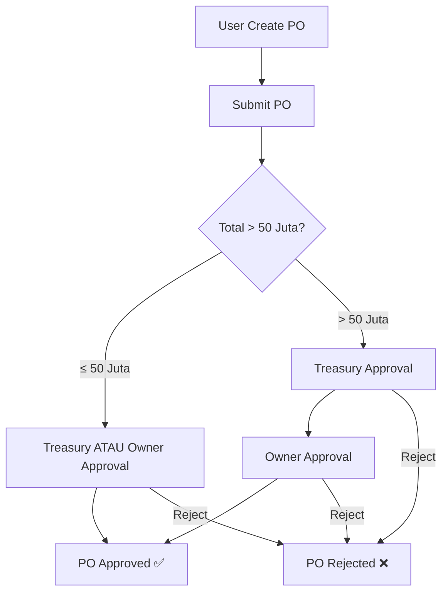
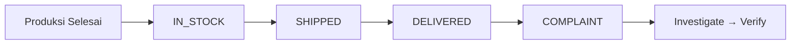
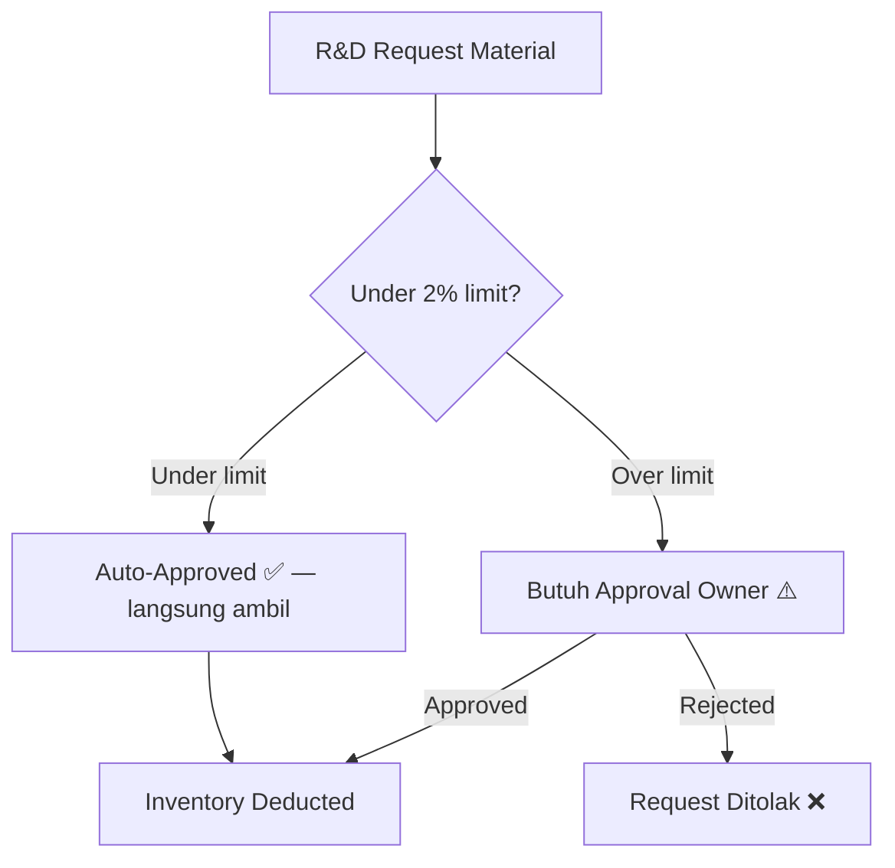
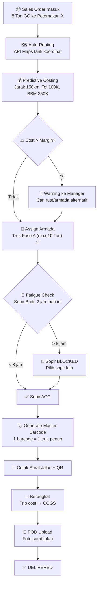
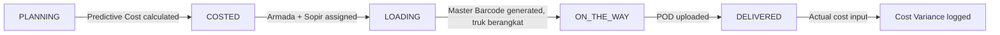
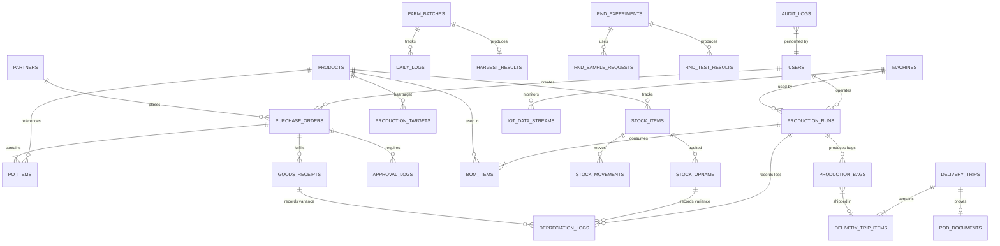

# Product Requirements Document (PRD) v3.1
## HiFeed Supply Chain Operations Management (SCOM)

**Versi**: 3.1 — Updated 15 Maret 2026
**Penulis**: Fendy Irfan (Tech Lead)
**Reviewer**: Ihsan (Owner/Director), Dania (Finance), Arif (Agronomis), Naura (Research Analyst)
**Status**: Active — Mockup Complete + Carbon Impact Dashboard

---

> [!IMPORTANT]
> Dokumen ini adalah **update** dari PRD v3.0 → v3.1 (15 Maret 2026). Perubahan utama:
> - ✅ **Carbon Impact Dashboard** (`/carbon`) — tracking jejak karbon hulu-hilir untuk investor pitch
> - ✅ **Account Receivable Dashboard** (`/sales/ar`) — tracking piutang klien
> - ✅ **Inline Forms** — Tambah Lahan, New Batch, New Order, Add User (tanpa pindah halaman)
> - ✅ **Updated Approval Logic** — Owner bisa approve PO ≤50 juta sebagai backup Finance

---

## Daftar Isi

1. [Ringkasan Eksekutif](#1-ringkasan-eksekutif)
2. [Struktur Role & Access Matrix](#2-struktur-role--access-matrix)
3. [Dashboard & Data Segmentation](#3-dashboard--data-segmentation)
4. [Standardisasi Penamaan & Kodifikasi](#4-standardisasi-penamaan--kodifikasi)
5. [Modul Procurement](#5-modul-procurement--strategic-sourcing)
6. [Modul Inventory & Depreciation](#6-modul-inventory--depreciation)
7. [Modul Farm Management](#7-modul-farm-management)
8. [Modul Production, Target & Barcode](#8-modul-production-target--barcode)
9. [Modul R&D](#9-modul-rd-research--development)
10. [Modul Logistics](#10-modul-logistics--distribution)
11. [Modul Sales / POS](#11-modul-sales--pos)
12. [Modul IT Admin](#12-modul-it-admin)
13. [Traceability & Supply Chain](#13-traceability--supply-chain)
14. [Carbon Impact Dashboard](#14-carbon-impact-dashboard-) 🆕
15. [Data Architecture & ERD](#15-data-architecture--erd)
16. [Technical Architecture](#16-technical-architecture)
17. [Implementation Roadmap](#17-implementation-roadmap)

---

## 1. Ringkasan Eksekutif

HiFeed SCOM adalah portal internal untuk mengelola seluruh rantai pasok operasional HiFeed: dari pembelian bahan baku (Procurement), pengelolaan lahan (Farm), produksi pakan (Production), hingga pengiriman ke customer (Logistics) dan penjualan (Sales/POS). Sistem ini dibangun dengan prinsip **full traceability** — setiap karung produk dapat dilacak ke batch, supplier, dan lahan asalnya melalui barcode unik.

### Scope Modul (11 Modul)

| # | Modul | Deskripsi | Halaman |
|---|---|---|---:|
| 1 | **Dashboard** | KPI overview (role-based), Charts, Alerts, Supply Chain, Batch Tracking, **Carbon Bank Widget** | 4 |
| 2 | **Procurement** | PO, GRN, Approval multi-layer, Term of Payment | 4 |
| 3 | **Inventory** | 3-cluster stock (RM, FG, Trading), Stock Ledger, Opname, **Barang Keluar (Movement Flagging)**, **Depreciation Tracking** | 5 |
| 4 | **Farm Management** | **Land/Area Mapping (inline form)**, Batch planting **(inline form)**, Daily Log, Mortality tracking, Harvest, Seeds | 6 |
| 5 | **Production** | BOM, Production Run, **Monthly Targets**, **Barcode per Karung**, IoT mesin | 3 |
| 6 | **R&D** | Sample request, Experiment tracking, Test results, Budget/pagu control | 3 |
| 7 | **Logistics** | Delivery Trip, **Predictive Costing**, **Map API**, **Fleet & Capacity**, **Wholesale Traceability (Master Barcode)**, **Driver Fatigue Mgmt**, POD | 6 |
| 8 | **Sales / POS** | Feed + Trading Orders **(unified, inline form)**, **Account Receivable (AR)** | 2 |
| 9 | **IT Admin** | Product Kodifikasi, User Management **(inline form)**, Data Export, System Settings, Audit Log | 5 |
| 10 | **Traceability** | Supply Chain visualization, Batch Tracking (terintegrasi di Dashboard) | 2 |
| 11 | **Carbon Impact** 🆕 | **Carbon Bank Dashboard** — dual pillar formula, dynamic variables, investor summary | 1 |
| | | **Total Halaman** | **40** |

---

## 2. Struktur Role & Access Matrix

> [!WARNING]
> Role disesuaikan dengan **struktur organisasi aktual** HiFeed. Penamaan role harus sesuai jabatan yang ada.

### 2.1 Daftar Role (8 Role)

| Role | Deskripsi Jabatan | Login |
|---|---|---|
| **Owner / Director** | Super Admin, approval transaksi >50 juta, set target produksi | SSO @hifeed.co |
| **IT Ops** | Backend infrastructure, security, system monitoring | SSO @hifeed.co |
| **Treasury / Finance** | Approval pembayaran, validasi costing, audit stok | SSO @hifeed.co |
| **Agronomist (Farm Manager)** | Input daily log, batch management, harvest | SSO @hifeed.co |
| **Production Operator** | Input produksi, BOM, generate barcode, mesin | SSO @hifeed.co |
| **R&D** | Request sampel, input eksperimen, test result | SSO @hifeed.co |
| **Logistics** | Delivery trip, POD, attach barcode ke surat jalan | SSO @hifeed.co |
| **Sales** | Input order feed, trading komoditas, follow up customer | SSO @hifeed.co |

### 2.2 Access Matrix

| Modul | Owner | IT Ops | Finance | Farm Mgr | Operator | R&D | Logistics | Sales |
|---|:---:|:---:|:---:|:---:|:---:|:---:|:---:|:---:|
| Dashboard | ✅ | ✅ | ✅ | ✅ | ✅ | ✅ | ✅ | ✅ |
| Procurement | ✅ | ❌ | ✅ | ❌ | ❌ | ❌ | ❌ | ✅ |
| Inventory | ✅ | ❌ | ✅ | 👁️ | 👁️ | 👁️ | 👁️ | ✅ |
| Farm | ✅ | ❌ | ❌ | ✅ | ❌ | 👁️ | ❌ | ❌ |
| Production | ✅ | ❌ | ❌ | ❌ | ✅ | 👁️ | ❌ | ❌ |
| R&D | ✅ | ❌ | 👁️ | ❌ | ❌ | ✅ | ❌ | ❌ |
| Logistics | ✅ | ❌ | ❌ | ❌ | ❌ | ❌ | ✅ | ✅ |
| Sales / POS | ✅ | ❌ | ✅ | ❌ | ❌ | ❌ | ❌ | ✅ |
| IT Admin | ✅ | ✅ | ❌ | ❌ | ❌ | ❌ | ❌ | ❌ |
| Traceability | ✅ | ✅ | ✅ | ✅ | ✅ | ✅ | ❌ | ❌ |

> ✅ = Full Access, 👁️ = View Only, ❌ = No Access

### 2.3 Segregation of Duties

- **IT Ops** memiliki akses ke backend/infra dan IT Admin module, tetapi **TIDAK** memiliki akses ke modul operasional bisnis (Procurement, Inventory, Sales, dll).
- **Owner** bisa meng-override approval Treasury jika Treasury berhalangan (backup approval).
- **Sales** punya akses ke Procurement (membuat PO), Inventory (lihat stok), dan Logistics (track pengiriman).
- Dashboard menampilkan **data berbeda per role** (lihat Section 3 — Dashboard Segmentation).

---

## 3. Dashboard & Data Segmentation

> [!IMPORTANT]
> Dashboard menampilkan data yang relevan per role. Owner & IT Ops melihat semua data. Role lain hanya melihat data yang relevan dengan tanggung jawabnya.

### 3.1 Stat Cards (KPI Utama) — Per Role

| KPI Card | Owner | Finance | Sales | Farm Mgr | Operator | Logistics | R&D | IT Ops |
|---|:---:|:---:|:---:|:---:|:---:|:---:|:---:|:---:|
| Total Inventory Value | ✅ | ✅ | ✅ | ❌ | ❌ | ❌ | ❌ | ✅ |
| Active Batches | ✅ | ❌ | ❌ | ✅ | ❌ | ❌ | ❌ | ✅ |
| Pending PO | ✅ | ✅ | ✅ | ❌ | ❌ | ❌ | ❌ | ✅ |
| Active Trips | ✅ | ❌ | ✅ | ❌ | ❌ | ✅ | ❌ | ✅ |
| Revenue (Month) | ✅ | ✅ | ✅ | ❌ | ❌ | ❌ | ❌ | ✅ |
| Production Output | ✅ | ❌ | ❌ | ❌ | ✅ | ❌ | ❌ | ✅ |
| R&D Budget Usage | ✅ | ✅ | ❌ | ❌ | ❌ | ❌ | ✅ | ✅ |
| Depreciation (Month) | ✅ | ❌ | ❌ | ✅ | ✅ | ❌ | ❌ | ✅ |

### 3.2 Performance Metrics — Per Role

| Metric | Owner | Finance | Sales | Farm Mgr | Operator | Logistics | R&D | IT Ops |
|---|:---:|:---:|:---:|:---:|:---:|:---:|:---:|:---:|
| Avg Mortality | ✅ | ❌ | ❌ | ✅ | ❌ | ❌ | ✅ | ✅ |
| Production (Month) | ✅ | ❌ | ❌ | ❌ | ✅ | ❌ | ❌ | ✅ |
| Labor Efficiency | ✅ | ❌ | ❌ | ✅ | ✅ | ❌ | ❌ | ✅ |
| Avg Cost/Trip | ✅ | ✅ | ✅ | ❌ | ❌ | ✅ | ❌ | ✅ |
| GP Margin | ✅ | ✅ | ✅ | ❌ | ❌ | ❌ | ❌ | ✅ |
| Overdue Invoices | ✅ | ✅ | ✅ | ❌ | ❌ | ❌ | ❌ | ✅ |

### 3.3 Charts — Per Role

| Chart | Visible To |
|---|---|
| Hasil Panen (KG) — Area chart | Owner, IT Ops, Farm Manager, R&D |
| Produksi vs Target (KG) — Bar chart | Owner, IT Ops, Operator |

### 3.4 Alerts — Per Module

Setiap alert di-tag dengan `module` (farm, procurement, inventory, production, logistics, sales, rnd). Alert hanya ditampilkan ke role yang relevaan:

| Alert Module | Visible To |
|---|---|
| `farm` | Owner, IT Ops, Farm Manager, R&D |
| `procurement` | Owner, IT Ops, Finance, Sales |
| `inventory` | Owner, IT Ops, Finance, Sales, Operator |
| `production` | Owner, IT Ops, Operator |
| `logistics` | Owner, IT Ops, Logistics, Sales |
| `sales` | Owner, IT Ops, Finance, Sales |
| `rnd` | Owner, IT Ops, Finance, R&D |

### 3.5 Dashboard Sub-Menu

Dashboard module berisi 4 sub-page:

| Page | Path | Deskripsi |
|---|---|---|
| **Overview** | `/dashboard` | KPI cards, charts, metrics, alerts, **Carbon Bank mini-widget** |
| **Supply Chain** | `/traceability` | Visualisasi supply chain end-to-end |
| **Batch Tracking** | `/traceability/batch` | Lacak journey per batch dari farm ke customer |
| **Carbon Impact** 🆕 | `/carbon` | Carbon Bank Dashboard (detail di Section 14) |

> Carbon Bank widget di halaman Overview menampilkan total tCO₂e saved secara ringkas, dengan link ke halaman `/carbon` untuk detail lengkap. Visible untuk role: Owner, IT Ops, Finance, RND.

---

## 4. Standardisasi Penamaan & Kodifikasi

> [!CAUTION]
> Penamaan bahan baku (Indigofera, Pakchong, dll) **TIDAK BOLEH** ditampilkan secara verbal/tekstual di sistem. Informasi ini merupakan **trade secret** HiFeed.

### 4.1 Tiga Layer Kodifikasi

| Layer | Tujuan | Contoh | Digunakan oleh | Dikelola di |
|---|---|---|---|---|
| **Internal Code** | Identifikasi bahan di dalam sistem | `DM_CPTN1` | Tim Internal | IT Admin - Kodifikasi |
| **External Code** | Komunikasi ke investor, publik | `RM 1: Crude Protein 25%` | BD, Investor | IT Admin - Kodifikasi |
| **Secret Name** | Nama asli (di-mask di UI) | `Indigofera mash` | Owner & IT Ops only | IT Admin - Kodifikasi |

### 4.2 Master Data Kodifikasi

| Code (Internal) | External Code | Cluster |
|---|---|---|
| `DM_CPTN1` | RM 1: crude protein 25%, crude fiber 17% | RAW_MATERIAL |
| `DM_CPTN2` | RM 2: crude protein 18%, crude fiber 22% | RAW_MATERIAL |
| `DM_MOLS` | RM 3: molase sugar content 60% | RAW_MATERIAL |
| `DM_GE1` | RM 5: gross energy 3500 kkal | RAW_MATERIAL |
| `DM_BKKO` | RM 3: crude protein 15%, crude fiber 20% | RAW_MATERIAL |
| `DM_CPRUP1` | RM 4: crude protein 28% crude fat 11% | RAW_MATERIAL |
| `FG_GC` | Green Concentrate | FINISHED_GOOD |
| `FG_PEL_C` | Pellet Complete | FINISHED_GOOD |
| `FG_PEL_GC` | Pellet GC | FINISHED_GOOD |
| `FG_SIL_MIX` | Silase Mix | FINISHED_GOOD |
| `FG_SIL_PUR` | Silase Pure | FINISHED_GOOD |

### 4.3 Implementasi Kodifikasi

- **Halaman IT Admin → Product Kodifikasi**: IT Admin mengelola mapping kode internal ↔ external ↔ secret name
- **Form input di seluruh modul**: User memilih produk dari dropdown menggunakan internal code
- **Data Export**: Saat export untuk investor, kode internal otomatis diterjemahkan ke kode external
- **Validasi**: Jika user menambahkan produk yang belum ada di master kodifikasi → sistem menampilkan **error "Mapping belum tersedia di IT Admin"**

---

## 5. Modul Procurement & Strategic Sourcing

### 5.1 Purchase Order (PO)

#### Status Enum PO

| Status | Definisi | Trigger |
|---|---|---|
| `DRAFT` | PO sudah diisi tapi belum disubmit | User save form |
| `PENDING_APPROVAL` | PO sudah submit, menunggu approval | User klik Submit |
| `APPROVED` | PO disetujui oleh approver | Approver klik Approve |
| `REJECTED` | PO ditolak oleh approver | Approver klik Reject + alasan |
| `PARTIAL_RECEIVED` | Sebagian barang sudah diterima | GRN partial created |
| `COMPLETED` | Seluruh barang sudah diterima | GRN final created |
| `CANCELLED` | PO dibatalkan | User/Approver cancel |

#### Field PO

| Field | Tipe | Keterangan |
|---|---|---|
| `po_number` | String | Auto-generated (PO-2026-XXXX) |
| `vendor_id` | FK | Referensi ke Master Vendor |
| `department` | String | Auto-set berdasarkan role (Ops, Farm, Sales, dll) |
| `items` | Array | Produk, **volume** (KG/unit), harga satuan |
| `total_amount` | Decimal | Total nilai PO |
| `order_date` | Date | Tanggal pemesanan |
| `expected_arrival_date` | Date | Tanggal kedatangan barang |
| `payment_due_date` | Date | Tanggal jatuh tempo pembayaran |
| `term_of_payment` | String | TOP (Net 30, COD, H+3, dll) |
| `status` | Enum | Status PO |
| `created_by` | FK | User yang membuat |
| `approved_by` | FK | User yang meng-approve |
| `approved_at` | Timestamp | Waktu approval |

### 5.2 Sistem Approval Multi-Layer

> [!IMPORTANT]
> **Batas materialitas Rp 50.000.000**
> - Transaksi **≤ Rp 50 juta**: Cukup 1 layer approval (Treasury **ATAU** Owner)
> - Transaksi **> Rp 50 juta**: Wajib 2 layer approval (Treasury **DAN** Owner)



### 5.3 Goods Receipt Note (GRN)

- Input manual berat timbangan saat menerima barang
- Wajib upload foto bukti timbangan
- Angka timbangan yang **berbeda** dari expected quantity → selisih otomatis dicatat sebagai **Depreciation** (stage: FARM)
- Partial receiving: sistem otomatis update status PO → `PARTIAL_RECEIVED`

### 5.4 Siapa Bisa Membuat PO

| Role | Department Label |
|---|---|
| Owner | Operations |
| Finance | Finance |
| Farm Manager | Farm |
| Operator | Production |
| R&D | R&D |
| Sales | Sales |

---

## 6. Modul Inventory & Depreciation

### 6.1 Tiga Cluster Inventory

| Cluster | Deskripsi | Contoh |
|---|---|---|
| **Raw Material** | Bahan baku untuk produksi feed | DM_CPTN1, DM_MOLS, DM_BKKO |
| **Finished Goods** | Barang jadi hasil produksi | FG_GC, FG_PEL_C, FG_SIL_MIX |
| **Trading Goods** | Barang beli-putus, tidak masuk produksi | Kemasan (PKG_KRG_65, PKG_KRG_59) |

### 6.2 Stock Opname

- User memilih produk → input jumlah fisik (KG)
- Sistem otomatis menghitung selisih vs jumlah di database
- Jika ada selisih → wajib input **alasan variance**
- Selisih negatif otomatis dicatat ke **Depreciation Log** (stage: INVENTORY)

### 6.3 Depreciation / Stock Shrinkage Tracking

> [!IMPORTANT]
> Depreciation tracking mengagregasi penyusutan dari 3 sumber data:
> - **GRN** (qty expected vs qty actual) → Farm stage
> - **Stock Opname** (qty sistem vs qty fisik) → Inventory stage
> - **Production Result** (BOM input vs output qty) → Production stage

#### Depreciation Reasons (6 Kategori)

| Kategori | Deskripsi | Terjadi di Stage |
|---|---|---|
| **Moisture Loss** | Penurunan berat karena penguapan kadar air | Farm, Inventory |
| **Handling Loss** | Tercecer saat bongkar muat / pemindahan | Farm, Inventory |
| **Spoilage** | Rusak karena jamur, hama, penyimpanan buruk | Inventory |
| **Processing Loss** | Material tersisa di mesin, sisa produksi tidak layak | Production |
| **Missing** | Hilang, tidak bisa dipertanggungjawabkan | Any stage |
| **Quality Reject** | Tidak memenuhi standar kualitas, harus dibuang | Production |

#### Depreciation Log Fields

| Field | Tipe | Keterangan |
|---|---|---|
| `id` | UUID | PK |
| `date` | Date | Tanggal kejadian |
| `stage` | Enum | `FARM`, `INVENTORY`, `PRODUCTION` |
| `reason` | Enum | 6 kategori di atas |
| `product_id` | FK | Produk yang menyusut |
| `initial_qty_kg` | Decimal | Berat awal |
| `loss_qty_kg` | Decimal | Berat yang hilang |
| `loss_percent` | Decimal | Persentase penyusutan |
| `reported_by` | FK | User yang melaporkan (auto dari login) |
| `notes` | Text | Keterangan detail |
| `batch_ref` | String | Referensi batch (optional) |

#### Siapa Input Depreciation?

| Stage | Diinput oleh | Di halaman mana |
|---|---|---|
| Farm → Gudang | Farm Manager | `/procurement/grn` — variance saat terima barang |
| Penyimpanan Gudang | Inventory Staff | `/inventory/opname` — selisih saat stock opname |
| Proses Produksi | Operator | `/production/result` — BOM vs output |

#### Dashboard Depreciation

Halaman `/inventory/depreciation` menampilkan:
- **4 stat cards**: Total Loss KG, Avg Shrinkage %, Total Events, Top Reason
- **Stage breakdown**: berapa KG loss di Farm vs Inventory vs Production (progress bar)
- **Reason breakdown**: grid 6 kategori dengan jumlah KG dan event count
- **Filterable table**: semua depreciation log, filter by stage & reason

### 6.4 Inventory Movement Flagging (Barang Keluar)

> [!IMPORTANT]
> Setiap barang yang keluar dari gudang **WAJIB** di-flag dengan kategori. Halaman: `/inventory/movement`.

| Flag | Deskripsi | Akun Accounting |
|---|---|---|
| `SALES` | Penjualan reguler | Revenue / AR |
| `MARKETING_SAMPLE` | Sampel ke customer potensial | Sales & Marketing Expense |
| `RND_SAMPLE` | Sampel untuk R&D (max 2% inventory) | R&D Expense |
| `WAREHOUSE_TRANSFER` | Pindah gudang (titip barang) | Tidak mengurangi valuasi |
| `DEFECT` | Barang rusak/spoilage (wajib upload foto bukti) | Write-off / Loss |
| `RETURN` | Retur dari customer | Reverse Revenue |

#### Hard Lock / Sistem Limitasi Sampel

> [!CAUTION]
> Jika akumulasi sampel melebihi pagu, form submission **di-block** oleh sistem (hard lock). User tidak bisa submit kecuali minta approval Owner.

| Jenis Sampel | Batas | Cara Hitung |
|---|---|---|
| **Marketing Sample** | Max **100 KG** total per periode | Sum of all MARKETING_SAMPLE movements |
| **R&D Sample** | Max **2%** dari total inventory value | Sum value of RND_SAMPLE vs 2% × Total Inventory Value |

#### Halaman Barang Keluar (`/inventory/movement`)

- **Progress bar pagu** — visual sisa kuota Marketing Sample (KG) dan R&D Sample (value) real-time
- **6 flag breakdown cards** — jumlah KG dan event count per kategori
- **Form inline** — pilih flag, produk, qty, destination, alasan → submit
- **Hard lock validation** — jika Marketing Sample > 100 KG atau R&D > 2% → error merah 🔒, form di-block
- **Log table** — semua movement tercatat dengan flag, akun accounting, dan alasan

### 6.5 Inventory Valuation — Weighted Average

```
Harga Per Unit = Total Nilai Pembelian / Total Volume (KG)
```

Label **"Items"** di form PO telah distandarisasi menjadi **"Volume"** agar konsisten dengan working sheet tim Accounting.

Harus sinkron dengan working paper Accounting.

---

## 7. Modul Farm Management

### 7.1 Land / Area Mapping

> [!IMPORTANT]
> Tim Farm mendaftarkan semua lahan beserta luasnya di halaman `/farm/lands`. Setiap batch tanam baru akan **memilih lahan mana** yang dipakai.

#### Field Lahan

| Field | Tipe | Keterangan |
|---|---|---|
| `id` | UUID | PK |
| `name` | String | Nama lahan (misal: "Lahan Canggu A") |
| `location` | String | Lokasi geografis |
| `area_sq_m` | Decimal | Luas dalam meter persegi |
| `area_ha` | Decimal | Luas dalam hektar |
| `soil_type` | String | Jenis tanah (Latosol, Andosol, dll) |
| `water_source` | String | Sumber air (Irigasi, Tadah Hujan, Sungai) |
| `status` | Enum | `ACTIVE`, `RESTING`, `PREPARATION` |
| `current_batch_id` | FK (nullable) | Batch tanam yang sedang aktif di lahan ini |
| `notes` | Text | Catatan lahan |

#### Status Lahan

| Status | Deskripsi |
|---|---|
| **Active** | Ada batch tanam yang sedang berjalan |
| **Resting** | Lahan istirahat setelah panen (pemulihan tanah) |
| **Preparation** | Lahan baru sedang disiapkan (pembersihan, pupuk dasar) |

#### Halaman Lands (`/farm/lands`)

- **4 stat cards**: Total Lahan, Total Area (Ha), Lahan Active, Batch Aktif
- **Inline form "Tambah Lahan"** 🆕 — klik tombol "Tambah Lahan" memunculkan form di halaman yang sama:
  - Nama Lahan, Lokasi, Luas Area (m²), Jenis Tanah (Latosol/Andosol/Regosol/Vulkanik), Sumber Air, Status awal
- **Land cards**: setiap lahan menampilkan area (Ha + m²), jenis tanah, sumber air, status, batch aktif
- **Link ke batch**: jika ada batch aktif, menampilkan batch code, product, dan HST

### 7.2 Batch Management

- Setiap penanaman = 1 **Batch ID** unik
- Batch harus **memilih lahan** dari daftar lahan yang tersedia saat dibuat
- Batch melacak: lokasi, tanggal tanam, initial qty, current qty, HST (Hari Setelah Tanam)
- QR Code fisik tahan air ditempel di lahan
- **Inline form "New Batch"** 🆕 — klik tombol "New Batch" memunculkan form:
  - Pilih Lahan, Jenis Tanaman (dari kodifikasi), Sumber Bibit (Internal/PO Baru), Initial Qty, Tanggal Mulai, Fase Awal (Nursery/Growing)

### 7.3 Daily Log

Input harian oleh Agronomist:
- Jumlah kematian tanaman (mortality count)
- Jumlah tenaga kerja + total jam kerja
- Catatan aktivitas (pemupukan, penyiraman, dll)

### 7.4 Mortality Rate vs Depreciation

| Konsep | Terjadi di mana | Definisi |
|---|---|---|
| **Mortality Rate** | 🌱 Farm (sebelum panen) | Tanaman yang mati di lahan. Dicatat di Daily Log |
| **Depreciation** | 📦🏭 Inventory & Production | Penyusutan bobot. Dicatat otomatis dari GRN/Opname/Production |

### 7.5 Replanting Rules

> [!CAUTION]
> Replanting pada lahan yang ada tanaman mati **HARUS** dibuat sebagai **Batch Baru**, BUKAN dicampur di batch yang sama.

---

## 8. Modul Production, Target & Barcode

### 8.1 Production Run

| Field | Keterangan |
|---|---|
| `run_number` | Auto-generated (PR-2026-XXX) |
| BOM (Bill of Materials) | Resep produksi per produk jadi |
| Output Product | Produk jadi (Green Concentrate, Pellet, Silase, dll) |
| Output Qty + UoM | Jumlah hasil produksi (KG) |
| Start/End Time | Jam mulai & selesai |
| Operator Count | Jumlah tenaga kerja |
| Machine ID | Mesin yang digunakan |
| Shift Code | Shift kerja (PAGI, SIANG, MALAM) |

### 8.2 Production Target (Monthly)

> [!IMPORTANT]
> **Hanya Owner yang bisa set target produksi bulanan.** Operator dan role lain hanya bisa melihat progress.

- **Dikelola di**: `/production/plan`
- **Di-set oleh**: Owner
- **Granularity**: Per produk jadi per bulan (KG)
- **Tampilan**:
  - **Overall progress bar** — total actual vs total target (warna: merah <40%, kuning <70%, biru <100%, hijau ≥100%)
  - **Per-product progress** — setiap finished good punya progress bar sendiri
  - Badge "🔒 Only Owner can edit" untuk non-Owner
- **Dashboard chart** "Produksi vs Target" otomatis membandingkan actual dari Production Result vs target

### 8.3 Barcode / Production ID per Karung

> [!IMPORTANT]
> Setiap karung produk jadi **WAJIB** memiliki barcode ID unik. Tujuan: traceability penuh dan anti false claim.

#### Format Barcode
```
HF-[PRODUCTION_RUN_NUMBER]-[SERIAL_3_DIGIT]
Contoh: HF-PR2026002-003
```

#### Bag Data Fields

| Field | Tipe | Keterangan |
|---|---|---|
| `barcode_id` | String (Unique) | ID per karung, auto-generated |
| `production_run_id` | FK | Link ke production run |
| `product_id` | FK | Produk jadi |
| `weight_kg` | Decimal | Berat per karung |
| `produced_at` | Date | Tanggal produksi |
| `quality_grade` | Enum | `A`, `B`, `C` |
| `status` | Enum | `IN_STOCK`, `SHIPPED`, `DELIVERED`, `COMPLAINT` |
| `delivery_trip_id` | FK | Link ke surat jalan (jika sudah dikirim) |
| `customer_name` | String | Customer tujuan |
| `complaint_note` | Text | Catatan komplain (jika ada) |

#### Status Flow per Karung



#### Role Responsibilities — Barcode

| Role | Tanggung Jawab |
|---|---|
| **Operator** | Generate barcode ID otomatis setelah produksi selesai (1 barcode per karung) |
| **Logistics** | Attach barcode ID ke surat jalan (DO) — scan karung saat loading truk |
| **Owner / Finance** | Lookup barcode saat ada complaint customer — verifikasi klaim valid atau false claim |
| **IT Ops** | Monitoring semua barcode data |

#### Complaint Handling Flow

```
Customer komplain → Minta barcode/nomor karung
    → Owner/Finance scan di /production/barcode
    → Keluar detail: batch bahan baku, BOM, tanggal produksi, mesin, shift
    → Verifikasi: apakah klaim valid?
    → Jika valid → flag karung sebagai COMPLAINT + catat notes
    → Jika false claim → tolak dengan bukti data
```

#### Barcode Lookup Page (`/production/barcode`)

- **Scan input** — ketik/scan barcode → lihat detail lengkap
- **Journey timeline** — visual Farm → Produksi → Karung → Kirim → Customer
- **Detail grid** — product, weight, machine, shift, BOM, tanggal
- **Complaint alert** — merah jika ada complaint aktif
- **Filterable table** — semua karung, filter by status
- **Stats** — total karung, in stock, shipped, delivered, complaints

### 8.4 IoT Integration

| Data Stream | Sumber | Penggunaan |
|---|---|---|
| Jam nyala mesin | Sensor power | Hitung durasi operasi riil |
| Temperatur mesin | Thermostat | Alert overheat, preventive maintenance |
| Konsumsi daya (KWH) | HP × jam × tarif PLN | Biaya listrik per production run |

---

## 9. Modul R&D (Research & Development)

### 9.1 Sample Request Workflow

Tim R&D **langsung request** material dari inventory selama masih **di bawah pagu** (max 2% inventory value). Jika melebihi → butuh approval Owner.



### 9.2 Experiment Tracking

| Field | Tipe | Keterangan |
|---|---|---|
| `experiment_id` | String | Auto-generated (EXP-2026-XXX) |
| `title` | String | Judul eksperimen |
| `objective` | Text | Tujuan riset |
| `start_date / end_date` | Date | Periode |
| `status` | Enum | `PLANNED`, `IN_PROGRESS`, `COMPLETED`, `CANCELLED` |
| `materials_used` | Array | List sample request yang dipakai |
| `findings` | Text | Kesimpulan / temuan |

### 9.3 Test Results

| Field | Tipe | Keterangan |
|---|---|---|
| `test_type` | Enum | `NUTRITIONAL`, `PALATABILITY`, `SHELF_LIFE`, `FIELD_TRIAL` |
| `parameter` | String | Misal: Crude Protein %, Moisture % |
| `value` | Decimal | Hasil pengukuran |
| `benchmark` | Decimal | Nilai standar / target |
| `pass_fail` | Boolean | Lolos atau tidak |

---

## 10. Modul Logistics & Distribution

> [!IMPORTANT]
> **Major update (16 Maret 2026)** — Modul logistik didesain ulang dari basic delivery tracking menjadi **B2B Wholesale Logistics Suite** berdasarkan arahan Ihsan. Perubahan utama:
> - Skala operasi: **Wholesale (truk penuh)**, bukan retail (per karung)
> - Traceability: **1 Master Barcode per truk**, bukan per karung
> - Predictive Costing: estimasi biaya **sebelum** truk berangkat
> - Fleet & Driver Management: validasi kapasitas + fatigue prevention

### 10.1 User Journey — Alur Kerja Lengkap



### 10.2 Predictive Costing (Estimasi Biaya Otomatis)

> [!CAUTION]
> Surat jalan (DO) **TIDAK BOLEH** dicetak sebelum Predictive Cost dihitung dan disetujui. Ini untuk mencegah margin "bocor" di jalan.

#### Formula Predictive Cost

```
Total Estimated Cost = Fuel Cost + Toll Cost + Driver Allowance + Misc

Where:
  Fuel Cost       = (Distance KM / Fuel Ratio) × Fuel Price per Liter
  Toll Cost       = Sum of toll gates on route (from Map API)
  Driver Allowance = Daily rate × Estimated trip days
  Misc            = Configurable buffer (parkir, uang muat, dll)
```

#### Predictive Cost Fields

| Field | Tipe | Sumber | Keterangan |
|---|---|---|---|
| `estimated_distance_km` | Decimal | 🤖 Map API | Jarak gudang → customer |
| `fuel_ratio_km_per_liter` | Decimal | 🤖 Auto dari vehicle | Rasio BBM per jenis kendaraan |
| `fuel_price_per_liter` | Decimal | ⚙️ System Settings | Harga BBM terkini (updateable) |
| `estimated_fuel_cost` | Decimal | 🤖 Kalkulasi | distance / ratio × fuel price |
| `estimated_toll_cost` | Decimal | 🤖 Map API / 📝 Manual | Biaya tol dari rute |
| `driver_daily_allowance` | Decimal | ⚙️ System Settings | Uang saku/makan per hari |
| `estimated_trip_days` | Integer | 🤖 Kalkulasi | Berdasarkan jarak + jam kerja |
| `misc_cost` | Decimal | 📝 Input manual | Biaya lain-lain |
| `total_estimated_cost` | Decimal | 🤖 Kalkulasi | Sum semua komponen |
| `cost_per_ton` | Decimal | 🤖 Kalkulasi | Total cost / total tonase |
| `margin_warning` | Boolean | 🤖 Auto-check | ⚠️ True jika cost/ton > selling margin |

#### Margin Warning Logic

```
IF (total_estimated_cost / total_weight_ton) > (selling_price_per_ton × margin_threshold%)
  → Show WARNING: "Biaya pengiriman melebihi {X}% dari margin. Pertimbangkan rute/armada alternatif."
  → Log ke alert → Notification ke Logistics Manager + Owner
```

### 10.3 Integrasi API Peta

#### Pilihan Provider

| Option | Kelebihan | Kekurangan | Biaya |
|---|---|---|---|
| **Google Maps API** | Akurat, toll data Indo | Berbayar per request | ~$5/1000 req |
| **Mapbox** | Customizable, murah | Toll data Indo kurang | ~$0.5/1000 req |
| **OSRM (Open Source)** | Gratis, self-hosted | Perlu maintain server | Free |

> **Rekomendasi**: Google Maps API untuk fase awal (akurasi tol Indonesia), evaluasi OSRM untuk cost optimization di fase berikutnya.

#### Cara Kerja di Sistem

1. **Sales input alamat customer** → sistem geocode ke koordinat (lat/lng)
2. **Logistics buat trip** → sistem auto-calculate:
   - Rute optimal dari Gudang HiFeed → Customer
   - Jarak (KM)
   - Estimasi waktu tempuh
   - Gerbang tol yang dilalui + tarif
3. **Data inject ke Predictive Costing** → cost otomatis terisi
4. **Admin bisa override** → jika ada rute custom yang lebih efisien

#### Customer Location Fields (tambahan di Master Partner)

| Field | Tipe | Keterangan |
|---|---|---|
| `address` | Text | Alamat lengkap |
| `latitude` | Decimal | Koordinat (auto dari geocoding) |
| `longitude` | Decimal | Koordinat (auto dari geocoding) |
| `district` | String | Kecamatan |
| `regency` | String | Kabupaten |

### 10.4 Fleet & Capacity Management (Manajemen Armada)

> [!IMPORTANT]
> HiFeed beroperasi di skala **B2B (Wholesale)** — pengiriman menggunakan truk besar (5–20 ton). Sistem **WAJIB** memvalidasi kapasitas kendaraan sebelum assign ke trip.

#### Master Data Kendaraan (`vehicles`)

| Field | Tipe | Keterangan |
|---|---|---|
| `id` | UUID | PK |
| `plate_number` | String (Unique) | Nomor plat kendaraan |
| `vehicle_type` | Enum | `PICKUP`, `ENGKEL`, `FUSO`, `TRONTON`, `TRAILER` |
| `brand` | String | Merk kendaraan |
| `max_capacity_ton` | Decimal | **Kapasitas maksimal (ton)** — kunci validasi |
| `fuel_ratio_km_per_liter` | Decimal | Rasio BBM (km/liter) — untuk Predictive Costing |
| `ownership` | Enum | `OWNED`, `VENDOR` |
| `vendor_name` | String (nullable) | Nama vendor jika armada sewa |
| `status` | Enum | `AVAILABLE`, `ON_TRIP`, `MAINTENANCE` |
| `notes` | Text | Catatan kendaraan |

#### Kapasitas per Jenis Kendaraan (Baseline)

| Tipe | Kapasitas Max | Rasio BBM | Use Case |
|---|---|---|---|
| **Pickup** | 1 ton | 12 km/L | Pengiriman kecil / sampel |
| **Engkel** | 5 ton | 8 km/L | Medium order |
| **Fuso** | 10 ton | 6 km/L | Standard wholesale |
| **Tronton** | 20 ton | 4 km/L | Big order |
| **Trailer** | 30 ton | 3.5 km/L | Bulk / antar-pulau |

#### Capacity Validation Logic

```
IF order_total_weight_ton > selected_vehicle.max_capacity_ton:
  → BLOCK submission
  → Show: "Order 10 Ton melebihi kapasitas Engkel (max 5 Ton).
           Gunakan Fuso atau pecah menjadi 2 trip."
  → Suggest: auto-recommend vehicle type yang cukup
```

### 10.5 Wholesale Traceability (1 Truk = 1 Master Barcode)

> [!WARNING]
> **Perubahan fundamental dari desain awal**: Barcode **BUKAN** per karung, melainkan **per truk/shipment**. Ini lebih efisien untuk skala B2B.

#### Konsep Master Barcode

```
┌──────────────────────────────────────────────┐
│  MASTER BARCODE: HF-DO2026-0042             │
│  ┌──────────┐                                │
│  │ QR CODE  │  Customer: Peternakan Sapi X   │
│  │          │  Tanggal: 16 Mar 2026          │
│  │          │  Total: 8 Ton Green Concentrate │
│  └──────────┘  Truk: B 1234 XYZ (Fuso)      │
│                                               │
│  🔍 Scan untuk Traceability Lengkap          │
└──────────────────────────────────────────────┘
```

#### Informasi yang Muncul Saat Scan

Ketika customer/investor scan Master Barcode, mereka melihat:

| Section | Data | Sumber |
|---|---|---|
| **Shipment Info** | DO number, tanggal, total tonase, customer | Logistics |
| **Product Detail** | SKU, qty per produk, kualitas grade | Production |
| **Production Trace** | Production run number, tanggal produksi, mesin, shift | Production |
| **BOM / Recipe** | Komposisi bahan baku (external code only!) | Production |
| **Farm Origin** | Blok lahan asal Indigofera, tanggal panen, batch ID | Farm (Arif) |
| **Carbon Impact** 🌿 | tCO₂e saved dari muatan ini, breakdown pilar | Carbon (Naura) |
| **Quality** | Test results terakhir (nutritional, palatability) | R&D |

#### Master Barcode Format
```
HF-DO[YYYY]-[SERIAL_4_DIGIT]
Contoh: HF-DO2026-0042
```

#### Database: `shipment_barcodes`

| Field | Tipe | Keterangan |
|---|---|---|
| `id` | UUID | PK |
| `barcode_id` | String (Unique) | Master barcode ID |
| `delivery_trip_id` | FK | Link ke delivery trip |
| `total_weight_ton` | Decimal | Total tonase di truk |
| `products_summary` | JSONB | SKU + qty breakdown |
| `production_runs` | JSONB | List production run IDs |
| `farm_batches` | JSONB | List batch IDs (asal lahan) |
| `carbon_impact_tco2e` | Decimal | Total tCO₂e dari muatan |
| `generated_at` | Timestamp | Waktu generate |
| `scanned_count` | Integer | Berapa kali di-scan (analytics) |

### 10.6 Driver Fatigue Management

> [!CAUTION]
> Jika sopir sudah menyetir **≥ 8 jam** dalam 1 hari, sistem **WAJIB MEMBLOKIR** nama sopir dari dropdown penugasan. Ini untuk keselamatan aset dan personel.

#### Master Data Sopir (`drivers`)

| Field | Tipe | Keterangan |
|---|---|---|
| `id` | UUID | PK |
| `name` | String | Nama sopir |
| `phone` | String | No. HP |
| `license_type` | Enum | `SIM_A`, `SIM_B1`, `SIM_B2` |
| `license_expiry` | Date | Masa berlaku SIM |
| `max_hours_per_day` | Integer | Batas jam kerja harian (default: 8) |
| `status` | Enum | `AVAILABLE`, `ON_TRIP`, `REST`, `OFF_DUTY` |

#### Shift & Driving Log (`driver_logs`)

| Field | Tipe | Keterangan |
|---|---|---|
| `driver_id` | FK | Sopir |
| `date` | Date | Tanggal |
| `trip_id` | FK | Trip yang dikerjakan |
| `start_time` | Time | Jam mulai mengemudi |
| `end_time` | Time | Jam selesai |
| `total_hours` | Decimal | Durasi (auto-calc) |
| `rest_taken` | Boolean | Sudah istirahat 1 jam? |

#### Fatigue Check Logic

```
today_hours = SUM(driver_logs WHERE driver_id = X AND date = TODAY)

IF today_hours >= max_hours_per_day:
  → Driver status = "REST" (auto)
  → REMOVE from dropdown list assignment
  → Alert: "Sopir Budi sudah menyetir 8 jam hari ini. Pilih sopir lain."

IF today_hours >= 4 AND rest_taken = FALSE:
  → WARNING: "Sopir belum istirahat. Wajib istirahat 1 jam sebelum lanjut."
```

#### Shift Standar (Configurable)

| Shift | Jam | Keterangan |
|---|---|---|
| Shift 1 | 08:00 – 12:00 | Pagi |
| Istirahat | 12:00 – 13:00 | **Wajib** (min 1 jam) |
| Shift 2 | 13:00 – 17:00 | Siang |
| Overtime | 17:00 – 20:00 | Hanya dengan approval Manager |

### 10.7 Delivery Trip Fields (Updated)

| Field | Tipe | Keterangan |
|---|---|---|
| `do_number` | String | Auto: DO-2026-XXXX |
| `sales_order_id` | FK | Link ke order Sales |
| `customer_id` | FK | Customer tujuan (dengan koordinat) |
| `vehicle_id` | FK | Kendaraan yang digunakan |
| `driver_id` | FK | Sopir yang ditugaskan |
| `route_data` | JSONB | Rute dari Map API (polyline, waypoints) |
| `status` | Enum | `PLANNING`, `COSTED`, `LOADING`, `ON_THE_WAY`, `DELIVERED` |
| `predictive_cost` | JSONB | Breakdown cost (fuel, toll, driver, misc) |
| `actual_cost` | Decimal | Biaya aktual setelah trip selesai |
| `cost_variance` | Decimal | Selisih predicted vs actual |
| `master_barcode_id` | FK | Link ke shipment barcode |
| `pod_url` | String | URL bukti surat jalan |
| `departure_time` | Timestamp | Waktu berangkat |
| `arrival_time` | Timestamp | Waktu sampai |

#### Status Flow



### 10.8 Proof of Delivery (POD)

- Upload foto surat jalan sebagai bukti pengiriman
- File disimpan di cloud storage
- Status trip berubah ke `DELIVERED` setelah POD diupload
- **Tambahan**: Customer bisa scan Master Barcode → confirm receipt di sistem

### 10.9 Halaman Logistics (Updated)

| Page | Path | Fitur Baru |
|---|---|---|
| **Trip List** | `/logistics/trips` | Filter by status, driver, vehicle. Show predictive vs actual cost |
| **Create Trip** | `/logistics/trips/create` | Map widget, auto-routing, predictive cost calculator, vehicle/driver selector with validation |
| **POD** | `/logistics/pod` | Upload + Master Barcode viewer |
| **Fleet** 🆕 | `/logistics/fleet` | Master data vehicle, status, maintenance schedule |
| **Drivers** 🆕 | `/logistics/drivers` | Master data sopir, daily driving hours, fatigue status |
| **Scan** 🆕 | `/logistics/scan` | Public: scan Master Barcode → full traceability view |

---

## 11. Modul Sales / POS

> [!IMPORTANT]
> Feed dan Trading orders telah **digabungkan** dalam satu halaman `/sales/feed` karena keduanya melewati proses PO yang sama.

### 11.1 Sales Orders (Feed + Trading) — Unified

Halaman `/sales/feed` untuk tracking **semua** penjualan — baik produk pakan jadi (Feed) maupun komoditas beli-putus (Trading).

#### Sumber Data per Kolom

| Kolom | Sumber | Keterangan |
|---|---|---|
| **Order ID** | 🤖 Auto-generate | Format: `ORD-2026-XXX` (Feed) / `TRD-2026-XXX` (Trading) |
| **Type** | 📝 Input Sales | Feed atau Trading |
| **Status** | 📝 Update Sales | Lead → Confirmed → Shipped → Delivered → Paid / Overdue |
| **Customer & Area** | 📝 Input Sales | Data pelanggan |
| **SKU** | 📝 Pilih dari master | Produk dari katalog kodifikasi |
| **Qty (KG)** | 📝 Input Sales | Volume pesanan |
| **Price/KG** | 📝 Input Sales | Harga jual per KG (hasil negosiasi) |
| **Cost/KG** | 🤖 Tarik otomatis | HPP dari Inventory + Logistics. Untuk Trading: dari Buy Price PO |
| **Total Price** | 🤖 Kalkulasi | Qty × Price/KG |
| **Total Cost** | 🤖 Kalkulasi | Qty × Cost/KG |
| **Margin/KG** | 🤖 Kalkulasi | Price/KG − Cost/KG |
| **Margin %** | 🤖 Kalkulasi | (Total Price − Total Cost) / Total Price × 100 |
| **GP Total** | 🤖 Kalkulasi | Total Price − Total Cost |
| **No. PO** | 📝 Input / link | Referensi PO terkait |
| **Type Payment** | 📝 Input Sales | COD, NET14, NET30, DP+Full |
| **No. Invoice** | 📝 Input Finance | Nomor invoice yang dikeluarkan |
| **Invoice Paid** | 📝 Update Finance | Status pembayaran |
| **Date Overdue** | 🤖 Kalkulasi | Tanggal jatuh tempo berdasarkan payment type |

> 📝 = Input manual, 🤖 = Otomatis dari sistem

**Inline Form "New Order"** 🆕 — klik tombol "New Order" memunculkan form di halaman:
- Pilih Order Type (Feed/Trading), Customer, SKU, Qty, Selling Price/KG, Payment Type

Dashboard widgets: Total Revenue, GP Total, Total Volume, Avg Margin %, Overdue Alerts.

### 11.2 Account Receivable (AR) — `/sales/ar`

> [!IMPORTANT]
> Dashboard khusus untuk melacak **piutang klien** beserta aging analysis.

Halaman `/sales/ar` menampilkan:
- **3 stat cards**: Total AR Outstanding, Overdue Amount, Collection Rate
- **AR Aging Breakdown**: Current (0-30 hari), 31-60 hari, 61-90 hari, >90 hari
- **Client-level AR table**: per customer — total piutang, invoices outstanding, last payment date, aging status
- **Payment history log**: setiap pembayaran yang masuk tercatat dengan tanggal, jumlah, dan sisa piutang

#### AR Status Flow

| Status | Trigger |
|---|---|
| `CURRENT` | Invoice belum jatuh tempo |
| `OVERDUE_30` | Lewat 30 hari dari due date |
| `OVERDUE_60` | Lewat 60 hari |
| `OVERDUE_90` | Lewat 90 hari → **escalation ke Owner** |
| `PAID` | Pembayaran lunas |

---

## 12. Modul IT Admin

### 12.1 Sub-modul IT Admin

| Sub-modul | Path | Deskripsi | Role |
|---|---|---|---|
| **Product Kodifikasi** | `/it-admin/kodifikasi` | Kelola mapping internal code ↔ external code ↔ secret name | Owner, IT Ops |
| **User Management** | `/it-admin/users` | CRUD user, assign role, **inline Add User form** (email mapping untuk SSO) | Owner, IT Ops |
| **System Settings** | `/it-admin/settings` | Konfigurasi parameter sistem (approval threshold, pagu R&D, dll) | Owner, IT Ops |
| **Data Export** | `/it-admin/export` | Export data untuk investor/eksternal (otomatis translate ke external code) | Owner, IT Ops |
| **Audit Log** | `/it-admin/audit` | Lihat semua aktivitas user (login, create, edit, delete, approve) | Owner, IT Ops |

### 12.2 Product Kodifikasi

- Manage internal code, external code, dan secret name per produk
- Secret name di-mask (******) di UI, hanya terlihat oleh Owner/IT Ops
- Validasi: jika ada produk baru di modul lain yang belum ada di master kodifikasi → error

### 12.3 Audit Log

Setiap aksi user tercatat:
- Login/logout
- Create/edit/delete data
- Approval/rejection PO
- Generate barcode
- Export data

---

## 13. Traceability & Supply Chain

### 13.1 Supply Chain Visualization (`/traceability`)

Tampilan visual end-to-end supply chain:
```
Supplier → Purchase → Inventory (RM) → Production → Inventory (FG) → Delivery → Customer
```

### 13.2 Batch Tracking (`/traceability/batch`)

Lacak journey per batch dari awal sampai akhir:
- Input: Batch ID atau barcode karung
- Output: Timeline lengkap — tanggal tanam, harvest, production run, BOM, delivery, customer
- Visualisasi: node-based journey diagram

### 13.3 Akses Traceability

Traceability menu ada di bawah Dashboard, accessible untuk semua role kecuali Logistics dan Sales (yang fokus di modul mereka masing-masing).

---

## 14. Carbon Impact Dashboard 🆕

> [!IMPORTANT]
> Modul ini ditujukan untuk **pitching ke investor**. Seluruh angka harus bisa diverifikasi dan variabel yang digunakan harus transparan serta bisa diubah tanpa perlu coding ulang.

### 14.1 Konsep: Dual Pillar Carbon Impact

Setiap 1 ton produk HiFeed yang terjual menghasilkan dampak karbon positif sebesar **0.7295 tCO₂e**, yang terdiri dari dua pilar:

| Pilar | Nama | Nilai | Sumber Data | Warna UI |
|---|---|---|---|---|
| 1 | **Enteric Methane Reduction** (Hilir) | 0.3771 tCO₂e/ton | Sales POS (total ton terjual) | 🔵 Biru |
| 2 | **Carbon Sequestration** (Hulu) | 0.3524 tCO₂e/ton | Farm Lands (total Ha aktif) | 🟢 Hijau |
| | **TOTAL** | **0.7295 tCO₂e/ton** | | |

### 14.2 Formula Detail

#### Pilar 1 — Enteric Methane Reduction
```
Konsumsi harian          = 3 kg/ekor/hari
Konsumsi tahunan         = 3 × 365 = 1,095 kg = 1.095 ton/ekor/tahun
Reduksi emisi per ekor   = 0.413 tCO₂e/tahun
Per ton produk           = 0.413 / 1.095 = 0.3771 tCO₂e
```

#### Pilar 2 — Carbon Sequestration
```
Fresh yield              = 15 ton/ha × 4 panen = 60 ton/ha/tahun
Dry weight               = 60 × 33% = 19.8 ton
After spoilage (14%)     = 19.8 × 86% = 17.028 ton
Product output (GC 30%)  = 17.028 / 30% = 56.76 ton GC/ha/tahun
Sequestration per Ha     = 20 tCO₂e/ha/tahun
Per ton produk           = 20 / 56.76 = 0.3524 tCO₂e
```

### 14.3 Dynamic Variables (8 Konstanta)

Owner dan RND dapat mengubah konstanta berikut langsung di halaman `/carbon` (section "Formula Variables"). Setelah diubah, seluruh dashboard auto-recalculate:

| Variable | Default | Unit | Keterangan |
|---|---|---|---|
| Daily Consumption / Cattle | 3 | kg/hari | Konsumsi pakan per ekor per hari |
| Emission Reduction Baseline | 0.413 | tCO₂e/tahun | Reduksi emisi per ekor per tahun |
| Dry Weight Conversion | 0.33 | rasio | Persentase berat kering (33%) |
| Spoilage Rate | 0.14 | rasio | Tingkat kehilangan (14%) — **idealnya dinamis dari Stock Opname** |
| Indigofera Formula Ratio | 0.30 | rasio | Persentase Indigofera dalam produk GC |
| Carbon Sequestration / Ha | 20 | tCO₂e/ha/thn | Karbon yang diserap per hektar per tahun |
| Fresh Yield / Ha / Harvest | 15 | ton | Hasil panen basah per hektar per panen |
| Harvests / Year | 4 | ×/tahun | Jumlah panen per tahun |

### 14.4 Halaman Carbon (`/carbon`)

| Section | UI | Keterangan |
|---|---|---|
| **Hero** | Gradient card hijau-biru | Angka raksasa tCO₂e saved, equivalen pohon, Magic Number badge |
| **Dual Pillars** | 2 kartu berdampingan | Biru (Enteric) + Hijau (Sequestration) dengan step-by-step formula |
| **Trend Chart** | Stacked area chart | Monthly carbon impact (Recharts), hijau di bawah + biru di atas |
| **Dynamic Variables** | 2-col grid | 8 konstanta, editable oleh Owner/RND |
| **Investor Summary** | Card + pie chart | "For every 1 ton → 0.7295 tCO₂e" dengan breakdown pie |

### 14.5 Dashboard Widget

Di halaman Overview (`/dashboard`), terdapat mini-card "Carbon Bank" yang menampilkan:
- Total tCO₂e saved (angka)
- Magic number per ton
- Link ke `/carbon`

Visible untuk: **Owner, IT Ops, Finance, RND**

### 14.6 Akses

| Aksi | Role |
|---|---|
| View Carbon Dashboard | Owner, IT Ops, Finance, RND |
| Edit Dynamic Variables | Owner, RND |

---

## 15. Data Architecture & ERD

### 15.1 Schema Tables

#### `purchase_orders`
```sql
po_number             VARCHAR(20) PK
vendor_id             UUID FK
department            VARCHAR(50)
items                 JSONB
total_amount          DECIMAL
order_date            DATE
expected_arrival_date DATE
payment_due_date      DATE
term_of_payment       VARCHAR(50)
status                ENUM
approval_layer        INT
created_by            UUID FK
approved_by           UUID FK
```

#### `products`
```sql
id                UUID PK
internal_code     VARCHAR(20) UNIQUE
external_code     VARCHAR(100)
secret_name       VARCHAR(100) -- encrypted at rest
display_name      VARCHAR(100)
category          VARCHAR(50)
cluster           ENUM('RAW_MATERIAL','FINISHED_GOOD','TRADING_GOOD')
default_uom       VARCHAR(10)
```

#### `stock_movements`
```sql
id               UUID PK
stock_item_id    UUID FK
movement_type    ENUM('SALES','MARKETING_SAMPLE','RND_SAMPLE','WAREHOUSE_TRANSFER','DEFECT','RETURN')
qty              DECIMAL
destination      VARCHAR(100)
reason           TEXT
evidence_url     VARCHAR(255)
created_by       UUID FK
created_at       TIMESTAMP
```

#### `depreciation_logs`
```sql
id               UUID PK
date             DATE
stage            ENUM('FARM','INVENTORY','PRODUCTION')
reason           ENUM('MOISTURE_LOSS','HANDLING_LOSS','SPOILAGE','PROCESSING_LOSS','MISSING','QUALITY_REJECT')
product_id       UUID FK
initial_qty_kg   DECIMAL
loss_qty_kg      DECIMAL
loss_percent     DECIMAL
reported_by      UUID FK
notes            TEXT
batch_ref        VARCHAR(50)
source_doc_type  VARCHAR(50) -- 'GRN', 'STOCK_OPNAME', 'PRODUCTION_RESULT'
source_doc_id    UUID
```

#### `production_targets`
```sql
id               UUID PK
month            DATE -- first day of month
product_id       UUID FK
target_qty_kg    DECIMAL
set_by           UUID FK -- must be Owner role
created_at       TIMESTAMP
updated_at       TIMESTAMP
```

#### `production_bags`
```sql
id                  UUID PK
barcode_id          VARCHAR(30) UNIQUE
production_run_id   UUID FK
product_id          UUID FK
weight_kg           DECIMAL
produced_at         DATE
quality_grade       ENUM('A','B','C')
status              ENUM('IN_STOCK','SHIPPED','DELIVERED','COMPLAINT')
delivery_trip_id    UUID FK NULLABLE
customer_name       VARCHAR(100)
delivered_at        DATE NULLABLE
complaint_note      TEXT
```

#### `approval_logs`
```sql
id              UUID PK
ref_table       VARCHAR(50)
ref_id          UUID
approver_id     UUID FK
approval_layer  INT
action          ENUM('APPROVED','REJECTED')
reason          TEXT
approved_at     TIMESTAMP
```

### 15.2 ERD Diagram



---

## 16. Technical Architecture

### 16.1 Frontend
- **Framework**: Next.js 16 + React 19
- **UI Library**: shadcn/ui
- **Charts**: Recharts
- **State**: React Context (Auth)
- **Auth**: Google SSO restricted to `@hifeed.co`

### 16.2 Backend
- **Framework**: Python Django + Django REST Framework
- **Database**: PostgreSQL 16
- **Auth**: Google OAuth2 → JWT tokens
- **Storage**: Cloud storage (GCS/S3) untuk foto, POD, bukti
- **IoT**: MQTT/WebSocket → Cloud ingestion pipeline
- **Barcode**: Generate QR/Barcode images, thermal printer support

### 16.3 Non-Functional Requirements
- Full online system (internet stabil)
- Audit trail: log user, timestamp, IP, action
- Wajib upload foto bukti fisik (timbangan, surat jalan, barang rusak)
- Barcode printing: standar printer thermal industri
- Role-based data segmentation di dashboard
- Data encryption: secret_name dienkripsi at rest

---

## 17. Implementation Roadmap

### Phase 1: Foundation & Core ✅
- [x] Setup repo, Docker, PostgreSQL, project structure
- [x] Google SSO integration (@hifeed.co)
- [x] Role-based access control (8 roles)
- [x] Sidebar navigation dengan role filtering
- [x] Login page dengan module preview

### Phase 2: Procurement ✅
- [x] Purchase Order CRUD (Create, List, Detail)
- [x] Multi-layer approval engine
- [x] Term of Payment fields
- [x] GRN (Goods Receipt Note) input

### Phase 3: Inventory ✅
- [x] 3-cluster inventory (RM, FG, Trading)
- [x] Stock view dengan multi-UoM conversion
- [x] Stock Opname
- [x] Inventory movement flagging
- [x] Depreciation tracking dashboard

### Phase 4: Farm Management ✅
- [x] Batch management (create, view)
- [x] Daily Log input (mortality, tenaga kerja)
- [x] Harvest recording

### Phase 5: Production ✅
- [x] Production Run (Plan, Result)
- [x] BOM logic
- [x] Monthly production targets (set by Owner)
- [x] Barcode / ID per karung (generate, lookup, complaint handling)

### Phase 6: R&D ✅
- [x] Sample Request workflow + pagu engine (max 2%)
- [x] Experiment tracking CRUD
- [x] Test Results & Lab Data logging
- [x] R&D Dashboard (budget usage, active experiments)

### Phase 7: Logistics ✅
- [x] Delivery trip management
- [x] POD upload
- [x] Barcode attachment ke surat jalan

### Phase 8: Sales/POS ✅
- [x] Feed Orders tracking (30+ fields)
- [x] Trading Commodities module

### Phase 9: IT Admin ✅
- [x] Product Kodifikasi (3-layer coding)
- [x] User Management
- [x] System Settings
- [x] Data Export (external code translation)
- [x] Audit Log

### Phase 10: Dashboard & Traceability ✅
- [x] Role-based dashboard data segmentation
- [x] Supply Chain visualization
- [x] Batch Tracking
- [x] Real-time alerts per module per role

### Phase 11: Sales Enhancements ✅ 🆕
- [x] Unified Feed + Trading Orders (single page `/sales/feed`)
- [x] Inline "New Order" form
- [x] Account Receivable (AR) Dashboard (`/sales/ar`)
- [x] Auto-calculate COGS, Margin, GP per order

### Phase 12: Carbon Impact Dashboard ✅ 🆕
- [x] Carbon formula constants (8 dynamic variables)
- [x] `calcCarbonMetrics()` — pure function for Pilar 1 (Enteric) + Pilar 2 (Sequestration)
- [x] Hero metric: total tCO₂e saved + tree equivalent
- [x] Dual pillar breakdown cards with step-by-step formula
- [x] Monthly trend chart (stacked Recharts area chart)
- [x] Dynamic Variables editor (Owner & RND can modify constants → auto-recalculate)
- [x] Investor Summary card with pie chart
- [x] Carbon Bank mini-widget on main Dashboard

### Phase 13: Inline Forms & UX Enhancements ✅ 🆕
- [x] Tambah Lahan — inline form di `/farm/lands`
- [x] New Batch — inline form di `/farm/batches`
- [x] New Order — inline form di `/sales/feed`
- [x] Add User — inline form di `/it-admin/users`
- [x] Comprehensive button audit (semua tombol CTA sudah memiliki halaman tujuan)
